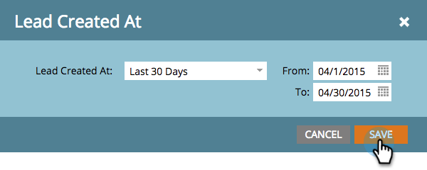

# 按收入阶段划分的人员报表 {#people-by-revenue-stage-report}

您可以创建一个报表，以显示您的人员处于收入周期模型的哪个阶段。 只要报表的给定日期范围内存在人员余额，报表就会包括指定模型中的任何阶段。

>[!AVAILABILITY]
>
>并非所有Marketo版本都包含此功能。 有关更多详细信息，请联系您的客户经理。

1. 转到 **Analytics**.

   

1. 单击报表 **按收入阶段划分的人员**.

   

1. 单击 **设置** 选项卡。 双击 **在以下位置创建的人员** 字段来设置要报告的所需时间范围。

   

1. 编辑时间范围并单击 **保存**.

   

1. 单击 **报表** 选项卡。 现在，您可以看到您的员工所处的收入模型的哪个阶段，并关注任何瓶颈。

   
