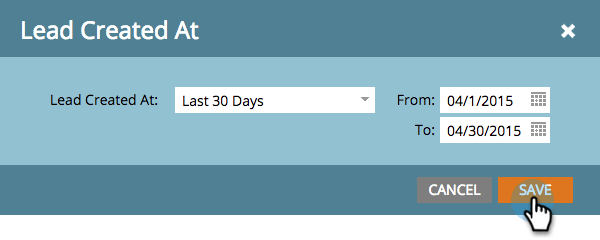

# 按收入阶段分类的人员报告 {#people-by-revenue-stage-report}

您可以创建一个报表，以显示您的人员处于收入周期模型的哪个阶段。 只要在报表的给定日期范围内存在人员余额，报表就包含指定模型中的任何阶段。

>[!AVAILABILITY]
>
>并非所有Marketo版本都包含此功能。 有关更多详细信息，请联系您的客户经理。

1. 前往 **[!UICONTROL Analytics]**。

   

1. 单击&#x200B;**[!UICONTROL People by Revenue Stage]**&#x200B;的报告。

   

1. 单击 **[!UICONTROL Setup]** 选项卡。双击&#x200B;**[!UICONTROL Person Created At]**&#x200B;字段以设置要报告的所需时间范围。

   

1. 编辑时间范围并单击&#x200B;**[!UICONTROL Save]**。

   

1. 单击 **[!UICONTROL Report]** 选项卡。现在，您可以看到您的人员处于收入模型的哪个阶段，并专注于任何瓶颈。

   
