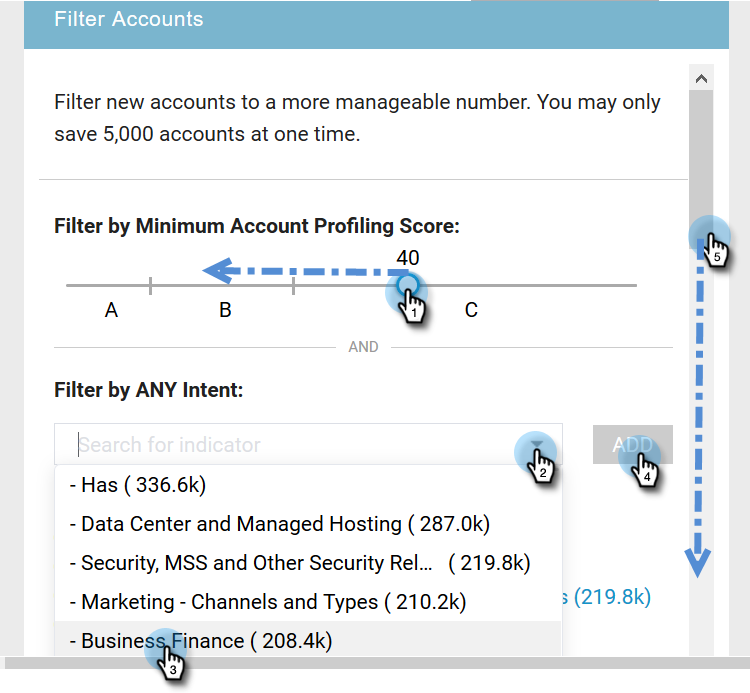

# 新帐户发现 {#new-account-discovery}

新帐户发现可使用理想客户资料中AI支持的推荐，帮助您找到要定位的新帐户。

>[!PREREQUISITES]
>
>[设置帐户分析](/help/marketo/product-docs/target-account-management/account-profiling/setting-up-account-profiling.md)

>[!TIP]
>
>建议按 **更新现有帐户** 按钮，以确保您查看的是最新数据。 此更新最长可能需要24小时。

1. 在我的Marketo中，单击 **Target帐户管理**.

   

1. 单击 **帐户分析** 选项卡。

   

1. 单击 **新帐户** 选项卡。

   

   >[!NOTE]
   >
   >新帐户显示TAM中尚未包含您的帐户列表。 根据您选择的过滤器，这些帐户可能会对您产生新影响。

1. 选择所有适用的过滤器（此部分是高度可自定义的，以下只是演示过滤的一个示例）。

   

1. 单击 **全部保存并创建列表** 在页面右下方。

   

   >[!NOTE]
   >
   >如果您只看到一些所需的帐户，则可以选择单击单个帐户并单击 **保存选定帐户** 完成时。

1. 您可以将您的列表添加到自己的新帐户列表，或将其添加到现有帐户列表。 在此示例中，我们将创建一个新的。

   

   >[!NOTE]
   >
   >要将其保存到现有帐户列表，请选择该选项，单击下拉列表并选择所需的帐户列表，然后单击 **下一个**.

1. 单击 **保存**.

   

   >[!NOTE]
   >
   >一次最多只能保存5,000个帐户。 如果您的搜索产生10,000个结果，则必须保存第一个（前）5,000个结果，然后重置过滤器并保存下一个5,000个结果。 的 **总计** 账户上限是100万。

1. 单击 **确定**.

   

   >[!TIP]
   >
   >在保存帐户后，您可以使用 [LinkedIn上的匹配受众](/help/marketo/product-docs/target-account-management/target/create-an-account-matched-audience-on-linkedin.md) 来攻击他们。
