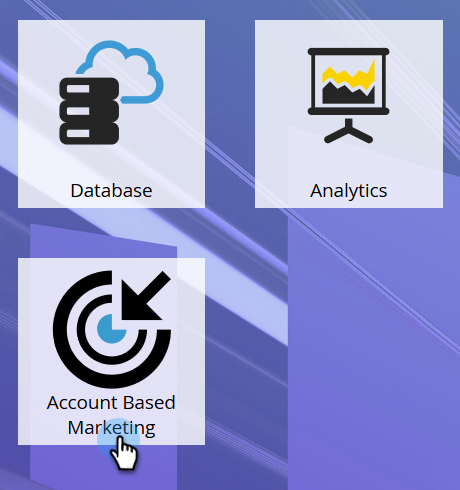

# 设置帐户概要分析{#setting-up-account-profiling}

请按照以下步骤使用“帐户分析”进行开始。

1. 在“我的市场”中，打开&#x200B;**基于帐户的营销**。

   

1. 单击“帐户分析”选项卡。

   

1. 默认情况下，“模型”(Model)选项卡处于打开状态。 单击&#x200B;**开始**。

   

1. 为您的模型提供一个名称，选择结果中将包括谁，以及谁将作为理想客户用户档案(ICP)的基础。 完成后，单击&#x200B;**创建模型**。

   

1. 您的模型将开始构建。 这可能需要一段时间，但不要担心，完成后会通知您。

   

1. 要查看模型的结果，请单击&#x200B;**参阅模型结果**。

   

   您的模型现已创建。

   

   >[!TIP]
   >
   >现在已创建模型，[了解如何调整它](/help/marketo/product-docs/target-account-management/account-profiling/account-profiling-ranking-and-tuning.md)。
