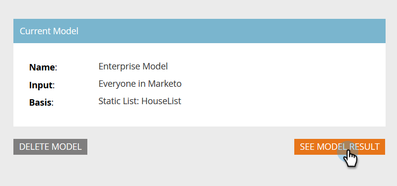

# 设置帐户分析 {#setting-up-account-profiling}

按照以下步骤开始使用“帐户分析”。

>[!CAUTION]
>
>以下字段必须 **非** 为了使“帐户分析”正常运行，将隐藏。
>
>* 网站
>* 公司
>* 电子邮件
>* 国家
>
>了解如何 [在此处取消隐藏字段](/help/marketo/product-docs/administration/field-management/hide-and-unhide-a-field.md#unhide-a-field).

1. 在“我的Marketo”中，打开 **目标帐户管理**.

   

1. 单击 **帐户分析** 选项卡。

   

1. 默认情况下，“模型”选项卡处于打开状态。 单击 **开始使用**.

   

1. 为您的模型提供一个名称，然后选择将用作理想客户配置文件(ICP)基础的人员的列表类型/列表。 单击 **创建模型** 完成时。

   

1. 您的模型将开始构建。 这可能需要一些时间，但请不要担心，完成后您会收到通知。

   

1. 要查看模型的结果，请单击 **查看模型结果**.

   

   此时将创建您的模型。

   

   >[!TIP]
   >
   >现在您的模型已创建， [了解如何对其进行调整](/help/marketo/product-docs/target-account-management/account-profiling/account-profiling-ranking-and-tuning.md).
