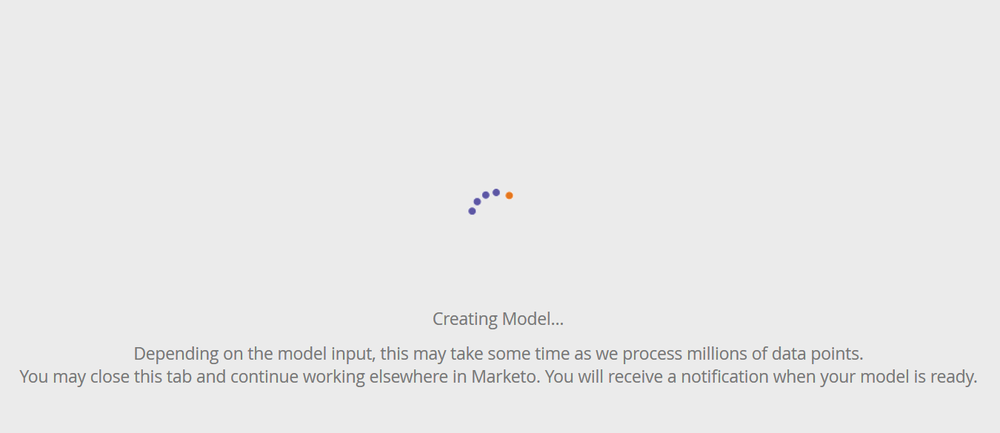

# 设置帐户分析{#setting-up-account-profiling}

请按照以下步骤开始使用帐户分析。

>[!CAUTION]
>
>要使帐户分析正常运行，必须隐藏以下字段：**不**。
>
>* 网站
>* 公司
>* 电子邮件
>* 国家

>
>
在此处了解如何[取消隐藏字段](/help/marketo/product-docs/administration/field-management/hide-and-unhide-a-field.md#unhide-a-field)。

1. 在我的Marketo中，打开&#x200B;**Target帐户管理**。

   

1. 单击&#x200B;**帐户分析**&#x200B;选项卡。

   

1. 默认情况下，“模型”(Model)选项卡会打开。 单击&#x200B;**开始**。

   

1. 为模型指定名称，选择要包含在结果中的人员，以及将作为理想客户资料(ICP)基础的人员。 完成后，单击&#x200B;**创建模型**。

   

1. 模型将开始构建。 这可能需要一段时间，但别担心，完成后会通知您。

   

1. 要查看模型的结果，请单击&#x200B;**参阅模型结果**。

   

   模型现已创建完成。

   

   >[!TIP]
   >
   >创建模型后，请[了解如何调节它](/help/marketo/product-docs/target-account-management/account-profiling/account-profiling-ranking-and-tuning.md)。
