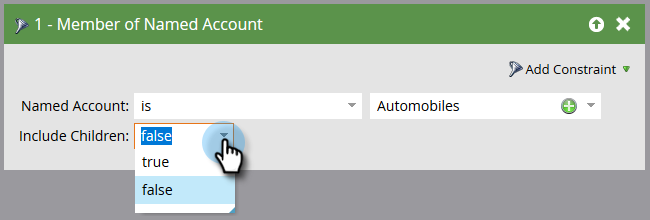

# 帐户筛选器 {#account-filters}

使用新的以客户为中心的过滤器，识别并吸引指定客户及其中的角色。

## TAM过滤器 {#tam-filters}

1. 选择您的智能营销活动并单击 **智能列表**.

   

1. 单击 **+** 以展开 **帐户筛选器** 文件夹。

   

1. 将要使用的过滤器拖到画布上。

   

## 帐户列表的成员 {#member-of-account-list}

要使用此筛选器，请单击帐户列表下拉列表……

...并选择所需的帐户列表。

>[!NOTE]
>
>对于“帐户列表的成员”筛选器，只有一个限定符：“是” — 其他限定符（例如“不是”和“是任何”）不可用。

## 指定帐户的成员 {#member-of-named-account}

首先，选择一个限定词。 **是** 特定指定帐户或 **为任意** 任何指定帐户的。

单击指定帐户下拉列表……

...并选择所需的指定帐户。

如果您使用“为任何”限定符，则可能需要使用 [约束](/help/marketo/product-docs/core-marketo-concepts/smart-lists-and-static-lists/using-smart-lists/add-a-constraint-to-a-smart-list-filter.md) 以缩小搜索结果的范围。 添加任意所需数量！

如果只需要来自单个顶级帐户的成员，请将“包括子代”设置为false。 如果希望成员来自所有子帐户，请选择true。

>[!MORELIKETHIS]
>
>[帐户触发器](/help/marketo/product-docs/target-account-management/engage/account-triggers.md)
