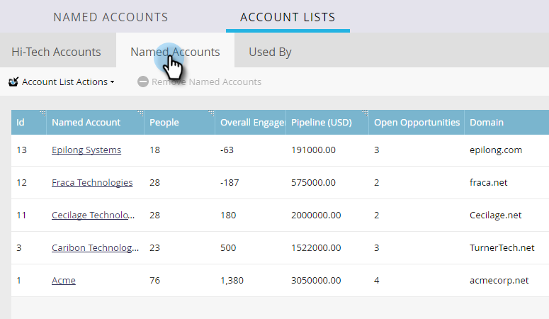

# 帐户列表分析 {#account-list-insights}

帐户列表仪表板提供该列表中所有指定帐户的汇总分析视图。

>[!NOTE]
>
>Marketo TAM会根据生成的管道或帐户参与度分数自动确定帐户列表中的排名最前的指定帐户。

## 帐户列表仪表板 {#account-list-dashboard}

要查看帐户列表的信息板，只需单击其名称……

...此时将显示功能板。

<table> 
 <tbody> 
  <tr> 
   <td colspan="1"><strong>管道</strong></td> 
   <td colspan="1">查看一段时间内的管道。 要逐周确定一段时间内的管道，我们将在最后一天获取管道。</td> 
  </tr> 
  <tr> 
   <td><strong>收入</strong></td> 
   <td>
查看随时间变化的收入。 为了逐周确定一段时间内的收入，我们取该周内赢得的所有收入的总和。
</td> 
  </tr> 
 </tbody> 
</table>

## “指定帐户”选项卡 {#named-accounts-tab}

单击 **指定帐户** 选项卡以了解哪些指定帐户属于该帐户列表。

>[!NOTE]
>
>您可以通过选择并点击此选项卡中的指定帐户来删除该帐户 **删除指定帐户**.

## “使用者”选项卡 {#used-by-tab}

单击 **使用者** 选项卡，以查看引用该帐户列表的资源。

