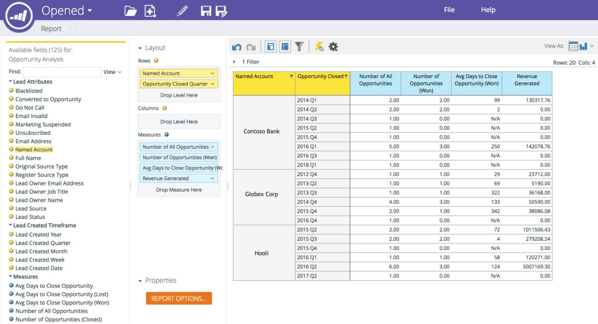

# RCA 中的命名帐户维度 {#named-account-dimension-in-rca}

使用收入周期Analytics中特定于TAM的指定帐户维度构建基于收入的报表。

>[!NOTE]
>
>**维度** — 为度量提供不同视图的属性（由黄点表示）。

>[!NOTE]
>
>RCA中的指定帐户维度可用于衡量目标帐户对利润的影响（例如，赢得的收入、生成的管道或销售周期中的加速）。 此维度还可用于确定哪些程序对指定帐户执行良好或执行不善。

以下报表具有对指定帐户维度的访问权限：

* 电子邮件分析
* 商机分析
* 机会分析
* 计划会员资格分析

>[!NOTE]
>
>下面是Revenue Cycle Analytics中的Marketo TAM的一些示例。

指定帐户中的管道加速

按指定客户列出的渠道效力和成功

方案效力和对利润的影响

指定客户中的质量销售线索和参与范围

