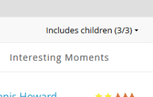
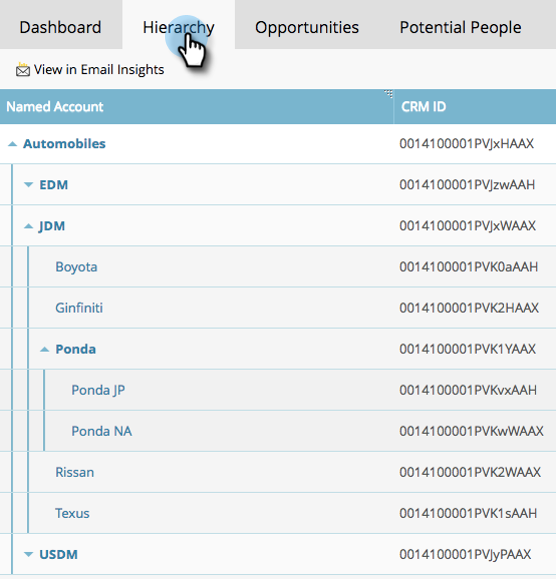

# 指定帐户分析 {#named-account-insights}

指定帐户仪表板提供目标帐户的360度全方位视图。

## 仪表板 {#dashboard}

仪表板在帐户级别从指定帐户内的所有人员汇总关键见解，因此无需联系每个人来评估其进度。 您可以使用更深入地了解电子邮件活动 [电子邮件分析](/help/marketo/product-docs/reporting/email-insights/filtering-in-email-insights.md#account-based-marketing).

>[!NOTE]
>
>图表显示过去90天的见解。

**随时间变化的帐户参与度** 单击 **视图** 右侧的下拉菜单来更改查看内容。 除了帐户得分之外，您还可以按总收入查看……

...或管道。

<table> 
 <tbody> 
  <tr> 
   <td><strong>帐户得分</strong></td> 
   <td>
根据您在“管理员”中创建的所有帐户得分，查看每周参与度。 您可以并排比较这些帐户分数。 要确定每周参与度，我们取该周任何一天的最大参与度。
</td> 
  </tr> 
  <tr> 
   <td><strong>管道</strong></td> 
   <td>查看一段时间内的管道。 要逐周确定一段时间内的管道，我们将在最后一天获取管道。</td> 
  </tr> 
  <tr> 
   <td><strong>收入</strong></td> 
   <td>查看随时间变化的收入。 为了逐周确定一段时间内的收入，我们取该周内赢得的所有收入的总和。</td> 
  </tr> 
 </tbody> 
</table>

**有趣的时刻**

面向Marketo Sales Insight的用户提供，可了解在帐户级别汇总的有趣时刻。

**顶级人员**

这些人员是根据指定帐户人员显示的回访间隔或紧急程度来计算的优先级(与 [最佳匹配](/help/marketo/product-docs/marketo-sales-insight/msi-for-salesforce/features/stars-and-flames/priority-urgency-relative-score-and-best-bets.md) （在销售分析中）或用户定义的分数。 **优先级** 仅适用于Marketo Sales Insight的用户。

**包括子项**

单击 **包括子项** 要查看和选择所选命名帐户的子帐户并查看其聚合分析，请执行以下操作：

>[!NOTE]
>
>选择帐户时，您可以选择全选，也可以单独选择最多100个。

## 层级 {#hierarchy}

查看所选指定帐户相对于其层次结构的位置。

## 机会 {#opportunities}

在帐户层上所有未结业务机会的汇总视图，帮助营销团队专注于关闭特定业务机会。

## 潜在人员 {#potential-people}

商机帐户匹配使用模糊逻辑来查找可以在“潜在人员”选项卡中解决的弱匹配。

>[!NOTE]
>
>要添加列出的任何人员，请选择他们并单击 **添加人员**.

## 使用者 {#used-by}

此选项卡显示当前引用特定指定帐户或帐户列表的智能营销活动、Web营销活动、智能列表或报表。

## 客户团队 {#account-team}

在此选项卡中查看帐户团队成员、添加/删除成员，甚至分配帐户所有者。

>[!NOTE]
>
>单击 **帐户团队操作** 下拉菜单以添加/删除帐户成员，或分配帐户所有者。

## ICP指标 {#icp-indicators}

查看您选择在执行以下操作时导出的ICP指示器 [调整您的模型](/help/marketo/product-docs/target-account-management/account-profiling/account-profiling-ranking-and-tuning.md#model-tuning).

