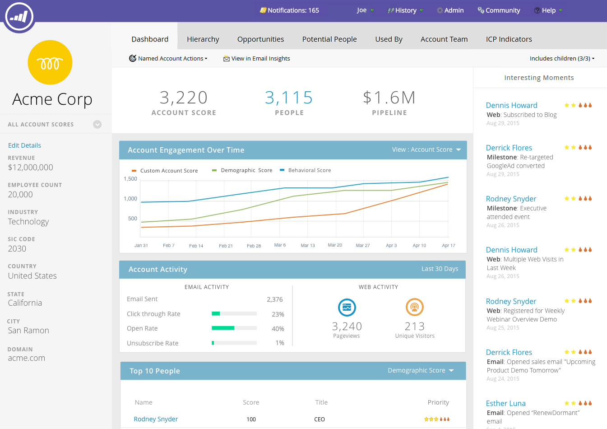
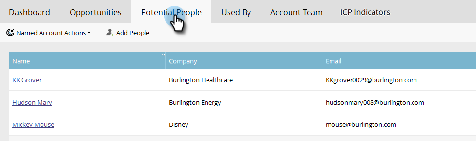

# 指定帐户分析{#named-account-insights}

指定帐户仪表板提供目标帐户的360度全方位视图。

## 仪表板{#dashboard}

仪表板聚合指定帐户内所有人员在帐户级别的关键洞察，从而避免让每个人评估其进度。 您可以使用[电子邮件分析](/help/marketo/product-docs/reporting/email-insights/filtering-in-email-insights.md#account-based-marketing)深入钻研电子邮件活动。

>[!NOTE]
>
>图表显示了过去90天的洞察。

**帐户持续** 时间 **** 互动单击右侧的“查看”下拉框以更改视图。除了帐户分数之外，您还可以按总收入……视图

...或管道。

<table> 
 <tbody> 
  <tr> 
   <td><strong>帐户分数</strong></td> 
   <td>
根据您在“管理员”中创建的所有帐户分数查看每周参与情况。 您可以并排比较这些帐户分数。 为确定每周参与度，我们从一周中的任何一天获取最大参与度。
</td> 
  </tr> 
  <tr> 
   <td><strong>管道</strong></td> 
   <td>随着时间的推移，了解渠道。 为了逐周确定输油管道，我们在最后一天开始管道。</td> 
  </tr> 
  <tr> 
   <td><strong>收入</strong></td> 
   <td>查看随时间推移的收入。 为确定每周的收入，我们会计算该周赢得的所有收入之和。</td> 
  </tr> 
 </tbody> 
</table>

**有趣的时刻**

Marketo Sales Insight的用户可查看帐户级别汇总的有趣时刻。

**顶级人物**

这些人员根据根据指定帐户的人员显示的近期情况或紧急情况（与Sales Insight中的[Best Bets](/help/marketo/product-docs/marketo-sales-insight/msi-for-salesforce/features/stars-and-flames/priority-urgency-relative-score-and-best-bets.md)相同）或用户定义的“分数”来计算优先级。 **Priority** 仅对Marketo Sales Insight的用户可用。

**包括子项**

单击&#x200B;**包括子项**&#x200B;查看并选择所选指定帐户的子帐户，并视图其聚合分析。

>[!NOTE]
>
>选择帐户时，您可以选择全选或单独选择最多100个帐户。

## 层次{#hierarchy}

查看选定的已命名帐户在其层次结构中的位置。

## 机会{#opportunities}

在帐户级别汇总所有未结商机，帮助营销团队专注于结束特定商机。

## 潜在人员{#potential-people}

“潜在客户对帐户”匹配使用模糊逻辑来查找可以在“潜在人员”选项卡中解决的弱匹配。

>[!NOTE]
>
>要添加任何列出的人员，请选择他们，然后单击&#x200B;**添加人员**。

## 由{#used-by}使用

此选项卡显示哪些智能活动、Web活动、智能列表或报表当前引用了特定的指定帐户或帐户列表。

## 帐户团队{#account-team}

视图帐户团队成员、添加/删除成员，甚至在此选项卡中分配帐户所有者。

>[!NOTE]
>
>单击&#x200B;**帐户团队操作**&#x200B;下拉框以添加/删除帐户成员，或分配帐户所有者。

## 比较方案指标{#icp-indicators}

视图您在[调整模型](/help/marketo/product-docs/target-account-management/account-profiling/account-profiling-ranking-and-tuning.md#model-tuning)时要导出的ICP指示器。

