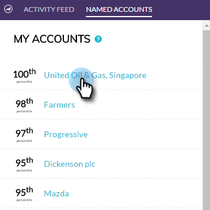

# [!DNL Account Insight]插件概述 {#account-insight-plug-in-overview}

[!DNL Account Insight]是一个[!DNL Chrome]插件，可为您的销售团队提供可操作的TAM和帐户分析，从而让他们能够更有效地与帐户接洽。

>[!AVAILABILITY]
>
>* 拥有TAM和Marketo Sales Insight的所有客户都包括帐户Insight。 对于只有TAM的客户，帐户Insight可作为已购买的加载项使用。 每个客户最多只能拥有250个Insight客户名额。 有关详细信息，请与您的销售代表联系。 它不适用于没有TAM的客户。
>
>* 此插件目前与[Adobe身份验证](/help/marketo/product-docs/administration/marketo-with-adobe-identity/adobe-identity-management-overview.md){target="_blank"}不兼容。

>[!CAUTION]
>
>[!DNL Account Insight]插件无法在启用了[SSO-only](/help/marketo/product-docs/administration/additional-integrations/restrict-user-login-to-sso-only.md)（单点登录）的订阅中工作。

>[!CAUTION]
>
>从帐户、潜在客户或联系人启动插件时，CRM上下文适用于Salesforce。 从帐户、潜在客户或联系人启动插件时，CRM上下文将不适用于Dynamics。 对于Dynamics用户，我们建议使用[!DNL Account Insight]插件。

## 指定帐户 {#named-accounts}

按帐户之间的级别查看指定帐户。 此列表仅对帐户所有者可用。 即将提供客户团队支持。

要查看指定帐户的详细信息，请单击其名称……

...并出现概述。

使用下拉菜单查看有趣的时刻。

向下滚动以查看最佳匹配。 有趣的时刻也在这里，参与的人也在这里。

单击人员姓名……

...并查看其活动。

您还可以将视图从&#x200B;**[!UICONTROL Engagement]**&#x200B;切换到&#x200B;**[!UICONTROL Pipeline]**。

要退出指定帐户，请单击右上角的X。

## [!UICONTROL Activity Feed] {#activity-feed}

活动信息源显示最近活动，可追溯到七天。

单击&#x200B;**[!UICONTROL Filter]**&#x200B;下拉列表以按不同的活动类型进行筛选。

有几个项目可单击。 单击指定帐户可查看其详细信息。 单击用户的名称可查看其活动。 单击&#x200B;**[!UICONTROL More Activities]**&#x200B;查看更多活动。

很酷的东西！

>[!MORELIKETHIS]
>
>[设置 [!DNL Account Insight]](/help/marketo/product-docs/target-account-management/setup-tam/set-up-account-insight.md)
