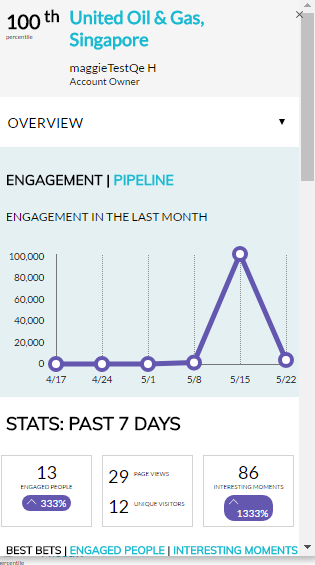

# Account Insight Plug-in概述{#account-insight-plug-in-overview}

Account Insight是Chrome插件，可向销售团队展示可操作的TAM和客户洞察，使他们能够更有效地与客户互动。

>[!AVAILABILITY]
>
>包含所有具有TAM和Marketo Sales Insight的客户的帐户分析。 对于仅拥有TAM的客户，Account Insight可作为已购买的加载项提供。 每位客户仅限250个帐户分析席位。 有关详细信息，请联系您的销售代表。 没有TAM的客户不能使用它。

>[!CAUTION]
>
>Account Insight插件在启用了[SSO-only](/help/marketo/product-docs/administration/additional-integrations/restrict-user-login-to-sso-only.md)（单点登录）的订阅中不工作。
>
>从“帐户”、“潜在客户”或“联系人”启动插件时，CRM上下文适用于Salesforce。 从“帐户”、“潜在客户”或“联系人”启动插件时，CRM上下文对Dynamics无效。 对于Dynamics用户，我们建议使用Account Insight插件。

## 指定帐户{#named-accounts}

查看指定帐户的排名顺序。 此列表仅适用于帐户所有者。 客户团队支持即将推出。

要查看指定帐户的详细信息，请单击其名称……

...并显示概述。

使用下拉列表查看有趣的时刻。

向下滚动以查看最佳结果。 有趣的时刻也来了，与参与其中的人一起。

单击人物姓名……

...看他们的活动。

还可以将视图从“参与”切换到“管道”。

要退出指定帐户，请单击右上角的X。

## 活动源{#activity-feed}

活动源显示最近的活动，可以追溯到七天。

单击&#x200B;**筛选器**&#x200B;下拉列表，按不同的活动类型进行筛选。

可单击多个项目。 单击指定帐户以查看其详细信息。 单击用户的名称以查看其活动。 单击“更多活动”，查看更多活动。

挺酷的！

>[!MORELIKETHIS]
>
>[设置帐户分析](/help/marketo/product-docs/target-account-management/setup-tam/set-up-account-insight.md)
