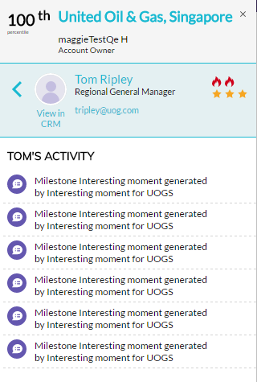

# 帐户分析插件概述 {#account-insight-plug-in-overview}

帐户分析是一个Chrome插件，可向您的销售团队展示可操作的TAM和帐户分析，从而让他们能够更有效地与帐户互动。

>[!AVAILABILITY]
>
>所有同时拥有TAM和Marketo Sales Insight的客户都可以使用Account Insight。 对于只拥有TAM的客户，客户分析可作为购买的加载项使用。 每个客户最多只能获得250个Account Insight名额。 有关详细信息，请与您的销售代表联系。 它不适用于没有TAM的客户。

>[!CAUTION]
>
>帐户分析插件不适用于具有以下特征的订阅： [仅限SSO](/help/marketo/product-docs/administration/additional-integrations/restrict-user-login-to-sso-only.md) （单点登录）已启用。

>[!CAUTION]
>
>从帐户、潜在客户或联系人启动插件时，CRM上下文适用于Salesforce。 从帐户、潜在客户或联系人启动插件时，CRM上下文将不适用于Dynamics。 对于Dynamics用户，我们建议使用帐户分析插件。

## 指定帐户 {#named-accounts}

按帐户之间的级别查看指定帐户。 此列表仅对帐户所有者可用。 即将提供客户团队支持。

要查看指定帐户的详细信息，请单击其名称……

...并出现概述。

使用下拉菜单查看有趣的时刻。

向下滚动以查看最佳匹配。 有趣的时刻也在这里，参与的人也在这里。

单击人员姓名……

...并查看其活动。

您还可以将视图从参与切换到管道。

要退出指定帐户，请单击右上角的X。

## 活动信息源 {#activity-feed}

活动信息源显示最近活动，可追溯到七天。

单击 **筛选** 下拉菜单以按不同的活动类型进行过滤。

有几个项目可单击。 单击指定帐户可查看其详细信息。 单击用户的名称可查看其活动。 单击更多活动可查看更多活动。

很酷的东西！

>[!MORELIKETHIS]
>
>[设置帐户分析](/help/marketo/product-docs/target-account-management/setup-tam/set-up-account-insight.md)
