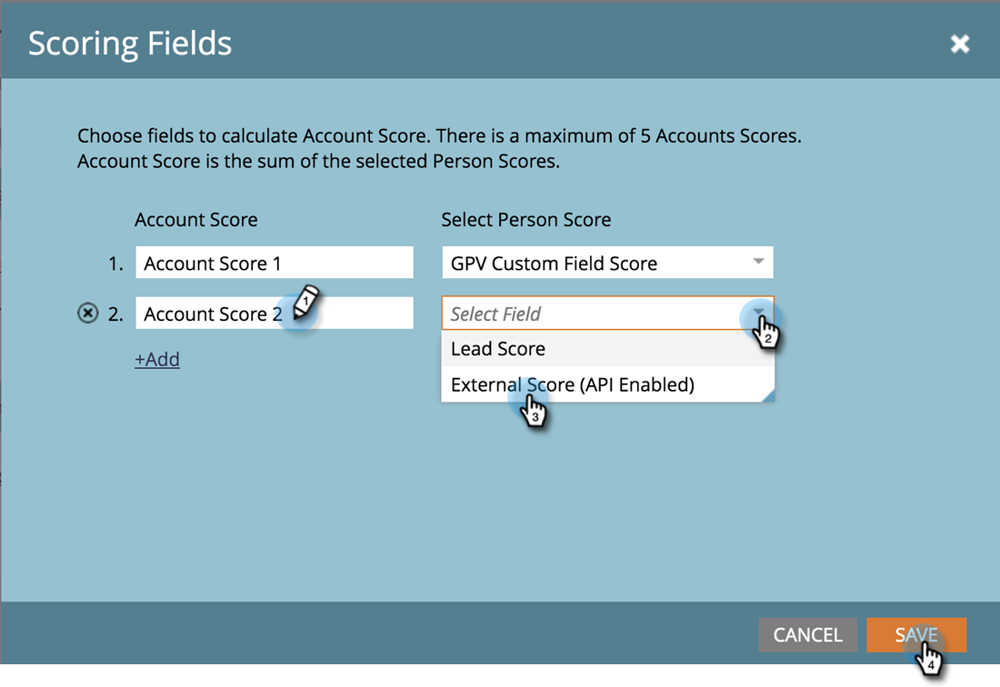

# [!UICONTROL Account Score] {#account-score}

帐户评分是[!UICONTROL Target Account Management]的重要组成部分。 它可帮助您确定客户的参与级别。

## 什么是帐户评分？ {#what-is-account-scoring}

这是一种系统化的方法，旨在帮助销售和营销团队识别最有可能购买的公司（包括潜在客户）并确定其优先级。

在B2B购买流程的复杂世界中，很少有一个人做出购买决定。 其中往往涉及各种角色，每个角色都有自己的需求。 基于帐户的评分通过汇总多个商机的商机得分并提供帐户级别的分数来考虑这一点。

## 常见示例 {#common-examples}

<table>
 <tbody>
  <tr>
   <td><strong>帐户参与度分数</strong></td>
   <td>根据特定目标帐户中人员的各种渠道（如电子邮件、Web和广告）跟踪的行为活动而确定的参与深度。</td>
  </tr>
  <tr>
   <td><strong>帐户产品兴趣分数</strong></td>
   <td>目标帐户中的人员对特定产品的内容感兴趣（例如，下载白皮书）。</td>
  </tr>
  <tr>
   <td><strong>帐户Web参与度分数</strong></td>
   <td>目标帐户的用户访问Web渠道。 可以创建相同的分数来测量电子邮件、广告或其他渠道的渠道参与度。</td>
  </tr>
 </tbody>
</table>

## 如何配置帐户得分 {#how-to-configure-account-score}

>[!NOTE]
>
>要计算帐户得分，您首先需要创建潜在客户得分。 Marketo TAM会自动将潜在客户得分汇总到客户得分。 例如，我们将以上述两个示例为例（_帐户产品兴趣分数_&#x200B;和&#x200B;_帐户Web参与度分数_）。
>
>首先，创建商机得分字段，以捕获目标帐户每个商机的相关详细信息。
>&#x200B;>然后，将这些潜在客户得分分配给他们各自的帐户得分：
>&#x200B;>帐户产品利息分数= SUM（商机产品利息分数）
>&#x200B;>帐户Web参与度得分= SUM（潜在客户Web参与度得分）

>[!NOTE]
>
>用户可以创建多个帐户参与度分数，并为不同的帐户分数分配不同的人员分数。

配置商机得分后，请按照以下步骤继续。

1. 单击 **[!UICONTROL Admin]**。

   

1. 单击 **[!UICONTROL Target Account Management]**。

   

1. 在[!UICONTROL Scoring Fields]中，单击&#x200B;**[!UICONTROL Edit]**。

   

   >[!NOTE]
   >
   >您最多可以选择&#x200B;**5个**&#x200B;字段来计算[!UICONTROL Account Score]。

1. 输入[!UICONTROL Account Score]名称，单击&#x200B;**[!UICONTROL Select Person Score]**&#x200B;下拉列表并选择相应的得分。

   

1. 单击&#x200B;**[!UICONTROL +Add]**&#x200B;以添加更多得分。

   

1. 添加所有所需分数。 完成后单击&#x200B;**[!UICONTROL Save]**。

   
