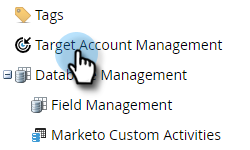
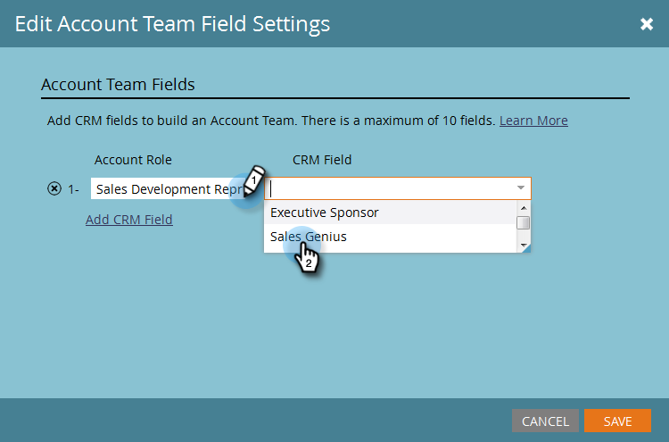

# 帐户团队设置 {#account-team-setup}

帐户团队是指在指定帐户中共同工作的一组利益相关者。 按照以下步骤选择应添加的CRM帐户角色。

1. 单击 **[!UICONTROL Admin]**。

   

1. 单击 **[!UICONTROL Target Account Management]**。

   

1. 在帐户团队成员下，单击&#x200B;**[!UICONTROL Edit]**。

   

   >[!NOTE]
   >
   >为[!UICONTROL Account Role]提供一个名称，并将其与CRM中所需的用户查找字段匹配。

1. 键入您的[!UICONTROL Account Role]名称并选择&#x200B;**CRM**&#x200B;字段。 最多加10。

   

   >[!NOTE]
   >
   >您无法选择[!UICONTROL Account Owner]。 默认情况下，这是从您的CRM中的帐户级别选择的。

1. 完成后，单击 **[!UICONTROL Save]**。

   

   >[!CAUTION]
   >
   >如果进行更新，则可能需要一些时间才能将更改反映在TAM中。

   >[!NOTE]
   >
   >* 将具有不同帐户所有者的多个CRM帐户合并到指定帐户时，Marketo将选择一个“帐户所有者”，并将其他帐户所有者添加为“帐户共同所有者”
   >
   >* 如果稍后重命名或删除CRM“角色”字段，Marketo TAM将停止同步更新的值，直到用户手动更新TAM中的设置为止
