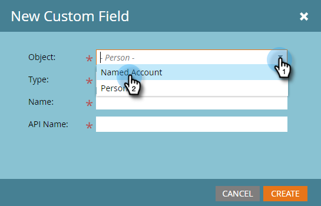
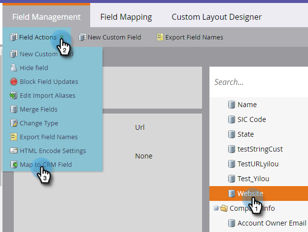

# 为 CRM 发现创建自定义字段 {#create-a-custom-field-for-crm-discovery}

将自定义字段添加到帐户，将它们映射到您的CRM，并将它们用于Marketo中的CRM帐户发现。

1. 单击 **[!UICONTROL Admin]**。

   

1. 单击&#x200B;**[!UICONTROL Field Management]**，然后单击&#x200B;**[!UICONTROL New Custom Field]**。

   

1. 点击 **[!UICONTROL Object]** 下拉菜单，并选择 **[!UICONTROL Named Account]**。

   

1. 单击&#x200B;**[!UICONTROL Type]**&#x200B;下拉列表并选择类型。

   

1. 输入&#x200B;**[!UICONTROL Name]** （API名称将自动填充）并单击&#x200B;**[!UICONTROL Create]**。

   

1. 创建字段后，从右侧的树中选择该字段。 点击 **[!UICONTROL Field Actions]** 下拉菜单，并选择 **[!UICONTROL Map to CRM Field]**。

   

1. 选择要映射到的CRM帐户字段，然后单击&#x200B;**[!UICONTROL Save]**。

   

   同步后，您的新字段将显示在发现CRM网格的最右侧。

   
