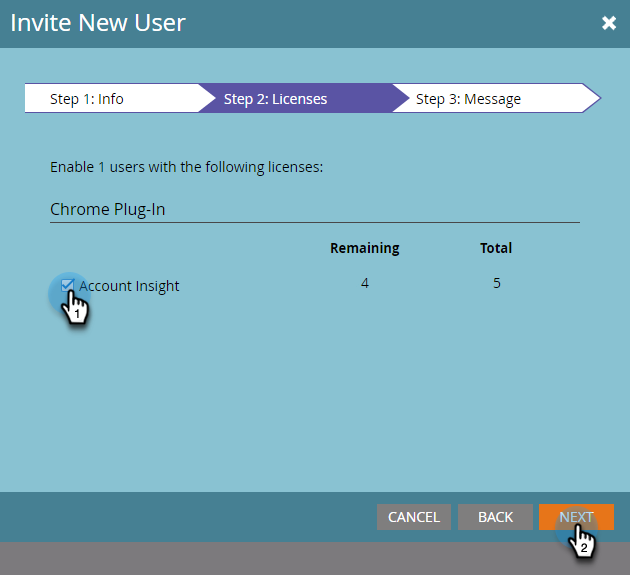

# 邀请用户访问帐户分析 {#invite-users-to-access-account-insight}

请按照以下步骤操作，让用户有权访问帐户分析。

1. 单击 **管理员**.

   

1. 单击 **用户和角色** 在树上。 然后单击 **销售用户** 制表符，和 **邀请新的销售用户**.

   

   可通过两种方式邀请用户：通过CRM或通过电子邮件。 在本例中，我们将使用“通过CRM邀请”。

   >[!NOTE]
   >
   >在通过CRM用户列表邀请新(非Marketo)用户时，您可以一次邀请多个人员。 电子邮件邀请为1等于1。

1. 单击 **CRM用户** 下拉列表并选择所需的用户。

   

   >[!NOTE]
   >
   >如果您选择 **通过电子邮件邀请用户**，只需输入其名字、姓氏和电子邮件地址，并继续执行步骤4。

1. 要设置用户访问的到期日期（可选），请单击日历图标。 默认情况下，设置为“从不”。

   

1. 单击 **下一个**.

   

1. 查看 **帐户分析** 复选框，然后单击 **下一个**.

   

1. 查看发送消息，进行任何所需的更改（可选），然后单击 **发送**.

   
