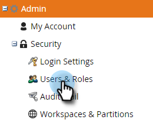
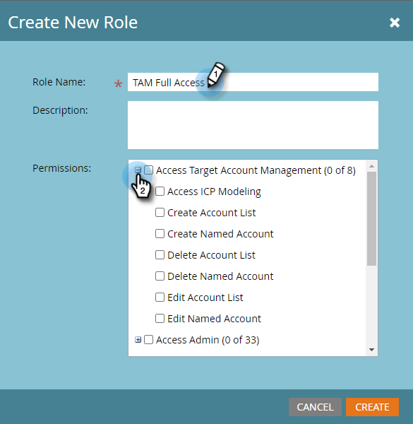

# 权限 {#permissions}

您需要为用户设置权限才能使用TAM。 操作方法如下：

1. 单击 **[!UICONTROL Admin]**。

   

1. 单击 **[!UICONTROL Users & Roles]**。

   

   >[!NOTE]
   >
   >您可以为现有角色添加TAM权限，或创建全新的角色。 此示例使用新角色。

1. 单击&#x200B;**[!UICONTROL Roles]**，然后单击&#x200B;**[!UICONTROL New Role]**。

   

1. 输入[!UICONTROL Role Name]并单击&#x200B;**[!UICONTROL Access Target Account Management]**&#x200B;复选框旁边的&#x200B;**+**&#x200B;图标。

   

1. 要选择&#x200B;_所有_&#x200B;权限，只需选中&#x200B;**[!UICONTROL Access Target Account Management]**&#x200B;复选框。

   

   >[!NOTE]
   >
   >您还可以选择仅选择部分选项。 分别选中每个复选框即可执行此操作。

1. 单击&#x200B;**+**&#x200B;以打开&#x200B;**[!UICONTROL Access Admin]**&#x200B;菜单。 选中&#x200B;**[!UICONTROL Access ABM Admin]**&#x200B;复选框（ABM是TAM的先前名称），然后单击&#x200B;**[!UICONTROL Create]**。

   

   您的新TAM角色现已准备就绪，可[分配给用户](/help/marketo/product-docs/administration/users-and-roles/managing-user-roles-and-permissions.md#assign-roles-to-a-user)！
