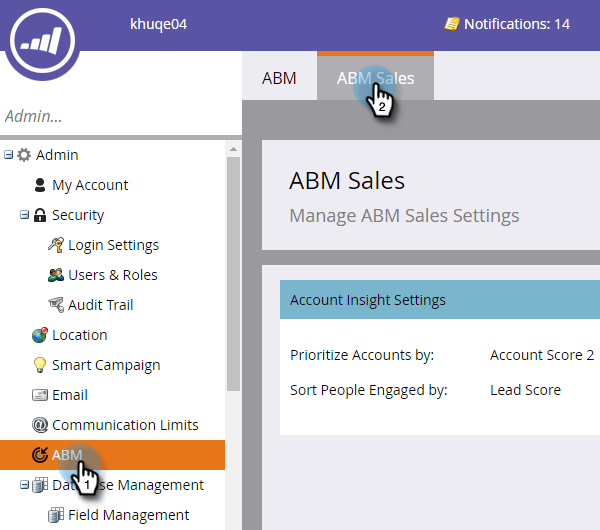

# 设置帐户分析{#set-up-account-insight}

下面介绍如何设置帐户分析。

>[!PREREQUISITES]
>
>必须首先配置ABM帐户分数。

1. 单击&#x200B;**管理员**。

   

1. 单击树中的&#x200B;**ABM** ，然后单击&#x200B;**ABM销售**&#x200B;选项卡。

   

1. 单击&#x200B;**编辑**。

   

1. 单击下拉列表，以选择“帐户分析”如何对指定帐户和参与人员进行优先级排序。

   

   >[!NOTE]
   >
   >如果在任何时间更新了[帐户得分设置](/help/marketo/product-docs/target-account-management/setup-tam/account-score.md)，则管理员需要更新“ABM销售”下的配置，以确保得分准确反映用户的偏好。 用户需要注销并重新登录才能看到更改。

1. 单击&#x200B;**保存**。

   
