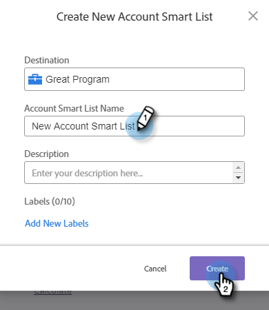

# 帐户智能列表 {#account-smart-lists}

下面介绍如何快速准确地识别您的高价值客户。

>[!NOTE]
>
>此功能仅适用于同时具有Target帐户管理加载项和已获得TAM许可的用户。

## 创建帐户智能列表 {#create-an-account-smart-list}

1. 在Marketo中，转到&#x200B;**营销活动**。

   

1. 查找并选择所需的程序。

   

1. 单击&#x200B;**新建**&#x200B;下拉列表，然后选择&#x200B;**新建本地资产**。

   

1. 单击&#x200B;**帐户智能列表**。

   

1. 输入名称并单击&#x200B;**创建**（说明和标签是可选的）。

   

您的帐户智能列表已创建！ 有关定义其规则的步骤，请参阅下文。

## 帐户智能列表规则 {#account-smart-list-rules}

帐户智能列表的工作方式与标准智能列表类似，但有一个显着例外：容器。

1. 要定义帐户智能列表，请单击&#x200B;**帐户智能列表规则**&#x200B;选项卡。

   

1. 选择所需的帐户过滤器。 在本例中，我们选择&#x200B;_行业是Healthcare_。

   

   

1. 选择匹配的人员筛选器。 在本例中，我们选择的是&#x200B;_State is California_。

   

**可选步骤**:这是集装箱的入口。如果您选择其他匹配的人员过滤器，则可以将其放在第一个过滤器下方，或放在&#x200B;_中的_&#x200B;下，以创建容器。 在本例中，我们通过添加&#x200B;_职位是CFO_&#x200B;来创建容器。

容器的外观如下。

>[!NOTE]
>
>创建过滤器容器会创建“和”规则，这意味着它将只返回所有合并的结果。 在本例中，将客户与医疗保健行业联系，并在加利福尼亚州&#x200B;_和_，其中某人列为首席财务官。 如果您不想使用容器，只需将过滤器放在现有容器的下方/上方。

就这样！ 请查看下面的部分，了解如何利用您的帐户智能列表。

>[!TIP]
>
>与使用标准智能列表一样，您可以使用高级逻辑进一步优化结果。 为此，您至少需要三个过滤器，而在帐户智能列表中，一个容器（不管其本身包含多少个过滤器）等于一个过滤器。

## 帐户智能列表操作 {#account-smart-list-actions}

在帐户智能列表的概述选项卡中，您会注意到一些操作选项。

**导出**:这会将帐户智能列表的结果导出为CSV。

**克隆**:制作帐户智能列表的副本。

**发送到广告网络**:将列表作为新的匹配受众发送到LinkedIn。

您还可以使用&#x200B;_帐户智能列表的人员成员_&#x200B;过滤器，在标准智能营销活动/列表中引用您的帐户智能列表。

>[!NOTE]
>
>智能帐户列表的人员成员结果将显示已识别帐户中的每个人，而不只是显示通过智能帐户列表中的匹配人员过滤器找到的人员。

>[!NOTE]
>
>**定义**
>
>**帐户智能列表的人员成员**:在本例中，“会员”一词是指账户本身，因此“人员”是指这些账户中的实际人员(Marketo记录)。
