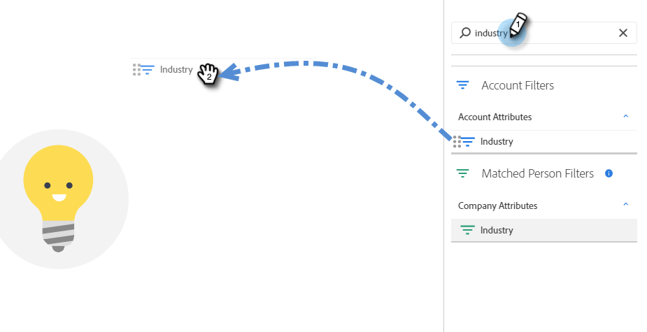

# 帐户智能列表{#account-smart-lists}

下面介绍如何快速准确地识别您的高价值客户。

>[!NOTE]
>
>此功能仅适用于启用了TAM和Adobe Marketo Engage下一代用户体验的用户。

## 创建帐户智能列表{#create-an-account-smart-list}

1. 在Marketo中，转到&#x200B;**营销活动**。

   

1. 查找并选择所需的项目。

   

1. 单击&#x200B;**新建**&#x200B;下拉框，然后选择&#x200B;**新建本地资产**。

   

1. 单击&#x200B;**帐户智能列表**。

   

1. 输入名称，然后单击&#x200B;**创建**（说明和标签是可选的）。

   

已创建帐户智能列表! 有关定义其规则的步骤，请参阅下文。

## 帐户智能列表规则{#account-smart-list-rules}

帐户智能列表的工作方式与标准智能列表类似，但有一个显着例外：容器。

1. 要定义帐户智能列表，请单击&#x200B;**帐户智能列表规则**&#x200B;选项卡。

   

1. 选择所需的帐户筛选器。 在此示例中，我们选择&#x200B;_行业是Healthcare_。

   

   

1. 选择您的匹配人员筛选器。 在此示例中，我们选择&#x200B;_州为California_。

   

**可选步骤**:这是容器的用武之地。如果您选择了其他“匹配人员过滤器”，则可将其放在第一个过滤器下，或放在&#x200B;_中的_，以创建容器。 在此示例中，我们将通过添加&#x200B;_职位是CFO_&#x200B;来创建容器。

容器的外观如下。

>[!NOTE]
>
>创建容器过滤器将创建“和”规则，这意味着它只返回所有合并的结果。 在此示例中，说明了医疗行业，以及位于加利福尼亚州&#x200B;_和_&#x200B;并有人列为首席财务官。 如果您不想利用容器，只需将过滤器放在现有过滤器的下方/上方。

就这样！ 请查看以下部分，了解如何利用您的帐户智能列表。

>[!TIP]
>
>就像使用标准智能列表一样，您可以使用高级逻辑进一步优化结果。 您至少需要三个过滤器才能执行此操作，在帐户智能列表中，一个容器(不管它本身包含多少个过滤器)等于一个滤镜。

## 帐户智能列表操作{#account-smart-list-actions}

在“帐户智能”列表的“概述”选项卡中，您会注意到一些操作选项。

**导出**:这会将帐户智能列表的结果导出为CSV。

**克隆**:制作帐户智能列表的副本。

**发送到广告网络**:将列表作为新的“已匹配”受众发送到LinkedIn。

您还可以使用&#x200B;_帐户智能列表的人员成员_&#x200B;过滤器在标准智能活动/列表中引用帐户智能列表。

>[!NOTE]
>
>帐户智能列表的“人员”会员的结果将显示已识别帐户中的每个人，而不仅仅是通过帐户智能列表中的“匹配人员”过滤器找到的人。

>[!NOTE]
>
>**定义**
>
>**帐户智能列表的人员成员**:在本例中，“成员”一词指帐户本身，因此“人员成员”指这些帐户中的实际人(Marketo记录)。
