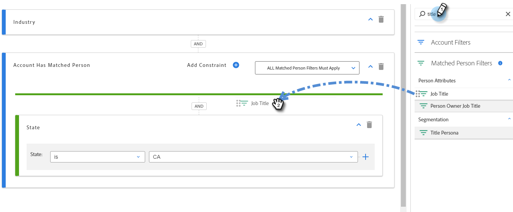

# 帐户智能列表 {#account-smart-lists}

下面是如何快速准确地识别您的高价值客户的。

>[!NOTE]
>
>此功能仅适用于同时具有[!UICONTROL Target Account Management]加载项和已颁发的TAM许可的用户。

## 创建[!UICONTROL Account Smart List] {#create-an-account-smart-list}

1. 在Marketo中，转到&#x200B;**[!UICONTROL Marketing Activities]**。

   

1. 查找并选择所需的程序。

   

1. 点击 **[!UICONTROL New]** 下拉菜单，并选择 **[!UICONTROL New Local Asset]**。

   

1. 单击 **[!UICONTROL Account Smart List]**。

   

1. 输入名称，然后单击&#x200B;**[!UICONTROL Create]** （说明和标签是可选的）。

   

您的[!UICONTROL Account Smart List]已创建！ 有关定义其规则的步骤，请参阅下文。

## [!UICONTROL Account Smart List]规则 {#account-smart-list-rules}

[!UICONTROL Account Smart Lists]的工作方式与标准智能列表类似，但存在一个显着异常：容器。

1. 要定义您的[!UICONTROL Account Smart List]，请单击&#x200B;**[!UICONTROL Account Smart List Rules]**&#x200B;选项卡。

   

1. 选择所需的帐户过滤器。 在此示例中，我们选择&#x200B;_[!UICONTROL Industry]为[!UICONTROL Healthcare]_。

   

   

   >[!NOTE]
   >
   >[帐户分析排名和调整](/help/marketo/product-docs/target-account-management/account-profiling/account-profiling-ranking-and-tuning.md)中使用的ICP指示符数据将显示为自定义帐户属性，以便在帐户智能列表中使用。 此自定义属性数据基于帐户个人资料模型的创建/更新时间。

1. 选择匹配的人员过滤器。 在此示例中，我们选择&#x200B;_州是加利福尼亚_。

   

**可选步骤**：容器将在此输入。 如果您选择其他匹配人员筛选器，则可以将其放在第一个筛选器下，或将其放在&#x200B;_中_&#x200B;以创建容器。 在此示例中，我们正在通过添加&#x200B;_职位是CFO_&#x200B;来创建容器。

以下是容器的外观。

>[!NOTE]
>
>创建过滤器容器将创建一个“and”规则，这意味着该规则将仅返回所有合并的结果。 在本例中，客户属于医疗保健行业，并且位于加利福尼亚&#x200B;_和_，而某人被列为CFO。 如果您不想使用容器，只需将过滤器拖放到现有过滤器的下方/上方。

就是这样！ 查看以下部分，了解如何利用[!UICONTROL Account Smart List]。

>[!TIP]
>
>与标准智能列表一样，您可以使用高级逻辑进一步优化结果。 要执行此操作，至少需要三个筛选器，而在[!UICONTROL Account Smart Lists]中，一个容器（无论其本身包含多少筛选器）等于一个筛选器。

## [!UICONTROL Account Smart List]操作 {#account-smart-list-actions}

在[!UICONTROL Account Smart List]的“概述”选项卡中，您会注意到一些操作选项。

**[!UICONTROL Export]**：这会将您的[!UICONTROL Account Smart List]的结果导出为CSV。

**[!UICONTROL Clone]**：复制您的[!UICONTROL Account Smart List]。

**[!UICONTROL Send to Ad Network]**：将列表作为新匹配的受众发送到[!DNL LinkedIn]。

您还可以使用[!UICONTROL Account Smart List]筛选器在标准智能营销活动/列表中引用&#x200B;_[!UICONTROL People Member of Account Smart List]_。

>[!NOTE]
>
>[!UICONTROL People Member of Account Smart List]的结果将显示已识别帐户中的每个人，而不仅仅是通过帐户智能列表中的匹配人员筛选器找到的人员。

>[!NOTE]
>
>**定义**
>
>**[!UICONTROL People Member of Account Smart List]**：在此例中，“会员”一词是指帐户本身，因此“人员会员”是指这些帐户中的实际人员(Marketo记录)。
