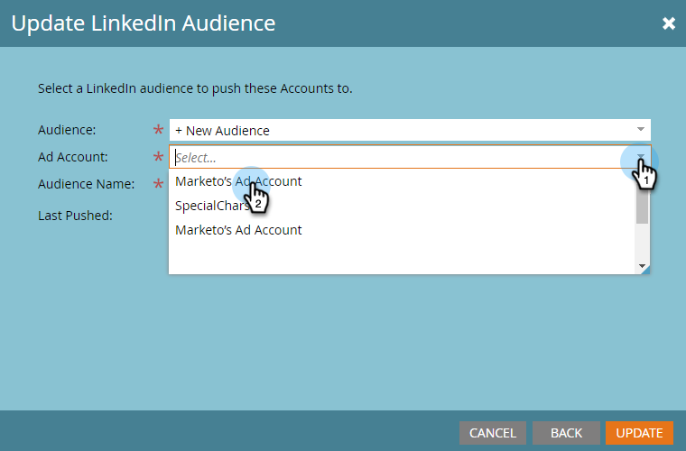

# 在[!DNL LinkedIn]上创建与帐户匹配的受众 {#create-an-account-matched-audience-on-linkedin}

从您的TAM帐户列表中为[[!DNL LinkedIn] 广告定位](https://business.linkedin.com/marketing-solutions/ad-targeting/account-targeting)创建匹配的帐户受众。 [!DNL LinkedIn]将列表与其系统中的帐户匹配，您可以根据该帐户列表创建一个[!DNL LinkedIn]受众以在各[!DNL LinkedIn]渠道中激活。 这允许营销人员定位数据库内或数据库外的人员。

>[!PREREQUISITES]
>
>[添加 [!DNL LinkedIn] 匹配的受众作为LaunchPoint服务](/help/marketo/product-docs/demand-generation/ad-network-integrations/add-linkedin-matched-audiences-as-a-launchpoint-service.md)

1. 在TAM中，单击&#x200B;**[!UICONTROL Account Lists]**&#x200B;选项卡。

   

1. 选择所需的帐户列表。

   

1. 单击&#x200B;**[!UICONTROL Account List Actions]**&#x200B;下拉菜单并选择&#x200B;**[!UICONTROL Send via AdBridge]**。

   

1. 选择&#x200B;**[!DNL LinkedIn]**&#x200B;并单击&#x200B;**[!UICONTROL Next]**。

   

1. 单击&#x200B;**[!UICONTROL Audience]**&#x200B;下拉列表。 您可以选择现有受众，也可以创建新受众。 在本例中，我们将创建一个新受众（如果您选择现有受众，请跳至步骤7）。

   

1. 单击&#x200B;**[!UICONTROL Ad Account]**&#x200B;下拉列表并选择目标广告帐户。

   

1. 命名您的受众，然后单击&#x200B;**[!UICONTROL Update]**。

   

就是这样。 您的帐户列表已推送到[!DNL LinkedIn]。

>[!MORELIKETHIS]
>
>[使用Marketo列表或智能列表作为 [!DNL LinkedIn] 受众区段](/help/marketo/product-docs/demand-generation/social/social-functions/use-a-marketo-list-or-smart-list-as-a-linkedin-audience-segment.md)
