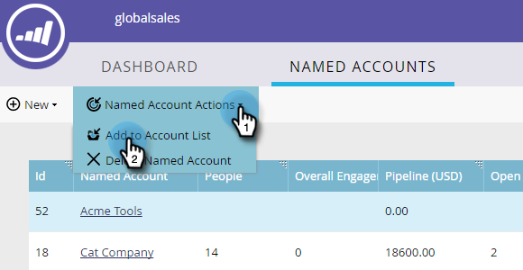

# 将现有命名帐户添加到帐户列表 {#add-an-existing-named-account-to-an-account-list}

向帐户列表添加指定帐户非常简单。

>[!NOTE]
>
>这仅适用于帐户列表， **not** 动态帐户列表。

1. 选择要添加到的已命名帐户的行。

   

1. 单击 **命名帐户操作** 下拉框并选择 **添加到帐户列表**.

   

1. 单击 **帐户列表** 下拉列表中，选择所需的帐户列表，然后单击 **添加**.

   

   就这样！

>[!MORELIKETHIS]
>
>[创建指定帐户](/help/marketo/product-docs/target-account-management/target/named-accounts/create-a-named-account.md)
