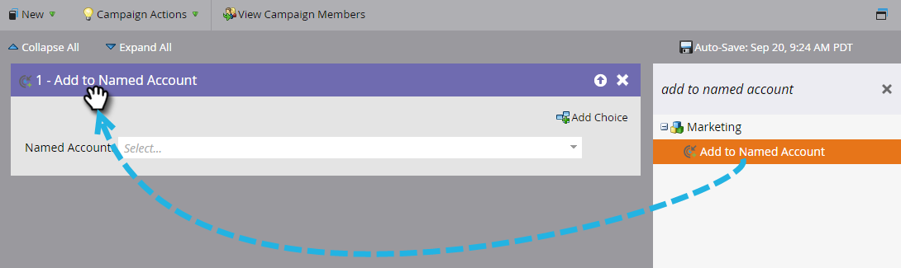

# 将人员添加到指定帐户{#add-people-to-a-named-account}

在TAM中，有三种不同的方法可手动将人员添加到指定帐户。

## 单流操作{#single-flow-action}

1. 单击&#x200B;**数据库**。

   

1. 输入人员的电子邮件地址，然后按Enter。

   

1. 单击该人员以选择它。 单击&#x200B;**人员操作**&#x200B;下拉列表，单击&#x200B;**营销**&#x200B;并选择&#x200B;**添加到指定帐户**。

   

1. 单击&#x200B;**命名帐户**&#x200B;下拉列表，选择所需的命名帐户，然后单击&#x200B;**立即运行**。

   

## 智能活动流步骤{#smart-campaign-flow-step}

1. 选择您的智能活动，然后单击&#x200B;**流量**。

   

1. 在搜索框中输入“添加到指定帐户”。

   

1. 将滤镜拖动到画布上。

   

1. 单击&#x200B;**命名帐户**&#x200B;下拉框并选择所需的命名帐户。

   

   就这样！ 接下来只需计划（或激活）您的智能活动，流程步骤将开始将符合条件的人员添加到指定的指定帐户。

## 列表导入{#list-import}

1. 选择您的列表，单击&#x200B;**列表操作**&#x200B;下拉框并选择&#x200B;**导入列表**。

   

1. 选择文件和设置后，单击&#x200B;**下一步**。

   

1. 映射所需字段。 确保映射了&#x200B;**命名帐户**&#x200B;字段。

   

1. 选择所需设置，然后单击&#x200B;**导入**。

   

>[!MORELIKETHIS]
>
>[潜在客户到帐户匹配](/help/marketo/product-docs/target-account-management/target/named-accounts/lead-to-account-matching.md)
