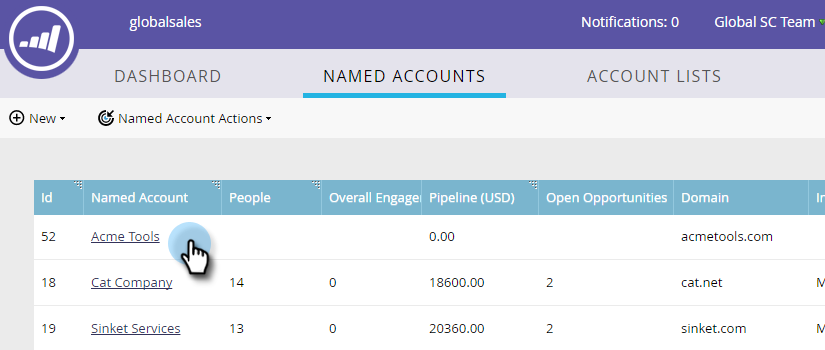
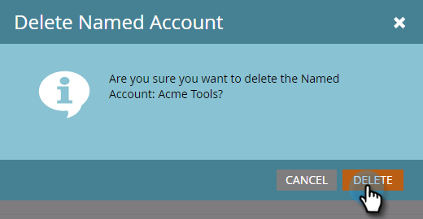

# 删除[!UICONTROL Named Account] {#delete-a-named-account}

按照以下快速步骤删除指定帐户。

1. 选择要删除的命名帐户的行。

   

   >[!NOTE]
   >
   >按住Ctrl并单击(Windows)或按住Cmd并单击(Mac)可选择多个命名帐户。

1. 点击 **[!UICONTROL Named Account Actions]** 下拉菜单，并选择 **[!UICONTROL Delete Named Account]**。

   

1. 单击 **[!UICONTROL Delete]**。

   

   >[!NOTE]
   >
   >在TAM中无法删除已同步到您的CRM的帐户。 如果删除选项不可用，或者如果您收到“由于选择一个或多个CRM帐户而无法删除这些帐户”消息，则必须直接在CRM中删除这些帐户。
