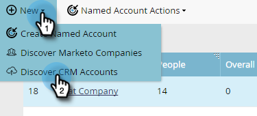
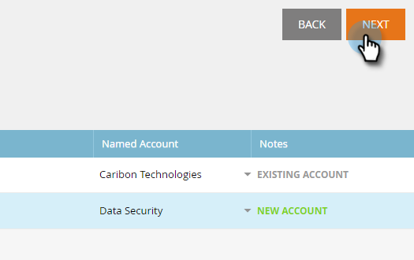

# 发现帐户{#discover-accounts}

使用Discover选项可识别潜在的目标帐户。

## 发现CRM帐户{#discover-crm-accounts}

从您的CRM中识别潜在目标帐户。

>[!NOTE]
>
>将CRM连接到Marketo TAM后，**Discover CRM帐户**&#x200B;将显示所有CRM帐户和相关信息，以帮助您选择正确的指定帐户。 Marketo在从CRM收到的内容的基础上添加其他信息。

**People** (在Discover CRM帐户和Discover Marketo公司中):包括联系人和潜在客户。可以使用Marketo的[潜在客户到帐户匹配](/help/marketo/product-docs/target-account-management/target/named-accounts/lead-to-account-matching.md)来发现潜在客户。

**潜在人员** (在Discover CRM帐户和Discover Marketo公司中):显示Marketo找到的可能属于CRM帐户的潜在客户数。

**自定义CRM字段** （仅在Discover CRM帐户中）：这将帮助您调整销售和营销组织，以选择正确的目标帐户。在您[将自定义CRM字段](/help/marketo/product-docs/target-account-management/setup-tam/create-a-custom-field-for-crm-discovery.md)与Marketo TAM映射后，我们将向您显示映射的数据，以帮助您识别目标帐户。

1. 在指定帐户中，单击&#x200B;**新建**&#x200B;下拉列表，然后选择&#x200B;**发现CRM帐户**。

   

1. 将打开一个新窗口/选项卡。 选择要添加到指定帐户的CRM帐户，然后单击&#x200B;**下一步**。

   

1. 预览屏幕会确认您的选择数量。 单击&#x200B;**创建**。

   

   这就是一切！

   

## 发现营销公司{#discover-marketo-companies}

确定适合定位的公司。

>[!NOTE]
>
>在Discover Marketo公司中，您会看到并非来自您的CRM的Marketo公司。

1. 在指定帐户中，单击&#x200B;**新建**&#x200B;下拉框，然后选择&#x200B;**发现营销公司**。

   

1. 将打开一个新窗口/选项卡。 选择要添加到您的指定帐户的公司，然后单击&#x200B;**下一步**。

   

   >[!NOTE]
   >
   >在Discover Marketo公司和Discover CRM， Marketo自动：
   >
   >* 从Marketo数据库中查找记录中列有该公司的人员。 如果您看到某些属性（例如，行业）的多个值，那是因为Marketo找到了为这些个人列出的不同值。 点击量最大的属性获胜
   >
   >仅在&#x200B;**Discover CRM**&#x200B;中，Marketo自动：
   >
   >* 将CRM联系人与指定帐户同步并关联
   >
   >仅在&#x200B;**Discover Marketo公司**&#x200B;中，Marketo自动：
   >
   >* 过滤器将大多数互联网服务提供商和公共域名（例如，yahoo.com、gmail.com）用作公司名
      >
      >
   * 删除CRM帐户。 如果您在一条记录中有“Acme”和“Acme Inc”(或以下任何后缀：Co， Corp， Corporation， Gmbh， Inc， Incorporated， LLC， LLP， Ltd， PA， PC， PLC， PLLC)，我们将在TAM中将它们合并为“Acme”
   >
   >如果您希望Marketo通过CRM ID或帐户所有者而不是公司名称来消除重复数据，请联系[ Marketo Support](https://nation.marketo.com/t5/Support/ct-p/Support)。

1. 单击“指定帐户”列下方的向下箭头以显示下拉列表。

   

   >[!CAUTION]
   >
   >今后，这些选定公司中的任何新人员将自动分配到各自的指定帐户。 请多次检查这些公司，并确保将它们分配给正确的指定帐户。

1. 要选择现有帐户，请单击&#x200B;**命名帐户**&#x200B;下拉框，选择所需的帐户，然后单击&#x200B;**下一个**。

   

   您还可以选择直接在下拉框中键入所需名称，以创建新命名帐户。 完成后，单击离开框……

   

   ...你会看到你的新指定帐户。 此时，只需单击&#x200B;**下一步**，如步骤4中所示。

   

1. 单击&#x200B;**创建**。

   

   干得好！

   

>[!NOTE]
>
>如果您看到所选的CRM帐户与Discover CRM网格中的内容不匹配，则可能是由于以下一个或多个原因造成的：
>
>* 拥有名称相似、被撤销的不同CRM帐户
>* 尚未发生下次计划同步

>[!MORELIKETHIS]
>
>[潜在客户到帐户匹配](/help/marketo/product-docs/target-account-management/target/named-accounts/lead-to-account-matching.md)
