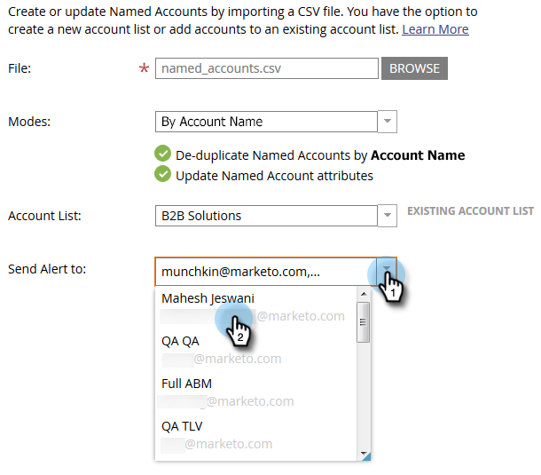
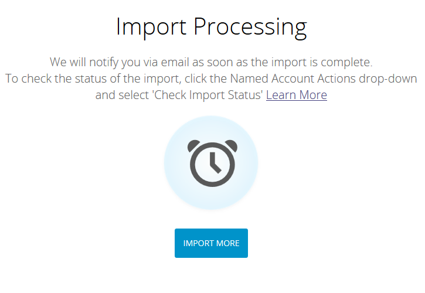

# 导入[!UICONTROL Named Accounts] {#import-named-accounts}

CSV中已经满是潜在的目标帐户吗？ 将它们直接导入TAM！

1. 点击 **[!UICONTROL New]** 下拉菜单，并选择 **[!UICONTROL Import Named Accounts]**。

   

1. 此时将打开一个新窗口。 单击&#x200B;**[!UICONTROL Browse]**，然后选择要导入的命名帐户的文件。

   

   >[!TIP]
   >
   >在您的文件中，提供[尽可能多的信息](/help/marketo/product-docs/target-account-management/target/named-accounts/named-account-overview.md#named-account-attributes)。 您只能添加固件信息；Marketo不计算任何内容（如Pipeline）。 要基于CRM帐户创建命名帐户，只需将帐户名和CRM ID从CRM导出到CSV文件中，使用帐户名选项，并在导入过程中映射CRM ID即可。 要将CRM帐户正确链接到指定帐户，您必须提供CRM帐户的准确名称。

1. 从两种重复数据消除模式中选择：帐户名或域名。 在本例中，我们将选择“帐户”。 点击 **[!UICONTROL Modes]** 下拉菜单，并选择 **[!UICONTROL By Account Name]**。

   

   >[!NOTE]
   >
   >如果选择&#x200B;**[!UICONTROL By Domain Name]**，则必须同时包含指定帐户和域字段。

1. 要选择指定帐户将添加到哪个帐户列表，请单击&#x200B;**[!UICONTROL Account List]**&#x200B;下拉列表并进行选择。

   

   >[!NOTE]
   >
   >您还可以在下拉框中键入全新[!UICONTROL Account List]的名称来创建该名称。

1. 要发送导入通知，请单击&#x200B;**[!UICONTROL Send Alert To]**&#x200B;下拉菜单并选择Marketo用户。 您&#x200B;_无法_&#x200B;手动输入电子邮件地址。

   

1. 单击 **[!UICONTROL Next]**。

   

1. 通过双击&#x200B;**[!UICONTROL Marketo Field]**&#x200B;下拉列表并选择相应的字段来映射每个字段。 完成后单击&#x200B;**[!UICONTROL Next]**。

   

   成功！

   

   >[!NOTE]
   >
   >“检查导入状态”仅显示活动的最近三天。

删除重复数据[!UICONTROL by Account Name]时的方案：

<table>
 <tbody>
  <tr>
   <td><strong>正在导入具有现有命名帐户名称的记录</strong></td>
   <td>
我们将更新现有记录
</td>
  </tr>
  <tr>
   <td><strong>正在导入具有新命名帐户名称的记录</strong></td>
   <td>我们将创建一个新记录</td>
  </tr>
 </tbody>
</table>

删除重复数据[!UICONTROL by Domain Name]时的方案：

<table>
 <tbody>
  <tr>
   <td><strong>正在导入具有新帐户名和新域名的记录</strong></td>
   <td>我们将使用提供的信息创建一个新的命名帐户</td>
  </tr>
  <tr>
   <td><strong>正在导入具有现有帐户名称和现有域名的记录</strong></td>
   <td>我们将更新现有的命名帐户</td>
  </tr>
   <tr>
   <td><strong>使用新帐户名称和现有域名导入记录</strong></td>
   <td>我们将向与域名匹配的现有命名帐户附加新帐户名并更新其他信息（即行业、州等）</td>
  </tr>
  <tr>
   <td><strong>正在导入具有现有命名帐户名称和新域名的记录</strong></td>
   <td>我们将向与帐户名称匹配的现有命名帐户附加新域名并更新其他信息（即行业、州等）</td>
  </tr>
 </tbody>
</table>

>[!NOTE]
>
>当Marketo附加指定帐户时，我们将更新规则（在后台），以允许我们识别应成为[!UICONTROL Named Account]一部分的人员。 示例：如果您将“IBM”更新为“IBM，USA”，则具有任一公司名称的人员将关联到[!UICONTROL Named Account]。

如果Marketo找到我们视为重复项的记录，我们将仅处理第一个记录。
