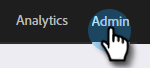

# 导致帐户匹配 {#lead-to-account-matching}

使用Marketo“潜在客户到帐户”匹配将右侧潜在客户匹配到右侧命名帐户。

>[!NOTE]
>
>**潜在客户到帐户匹配** 是Marketo Target帐户管理的内置功能。 它使用模糊逻辑，近乎实时地自动将潜在客户匹配到正确的指定帐户。 这些指定帐户可以是CRM帐户或Marketo公司。

## 概述 {#overview}

Marketo客户到帐户匹配遵循4步流程：

**步骤1 -** 我们的匹配流程首先使用潜在客户记录上的关键信息，例如：

* 电子邮件域（例如acme.com）
* 从IP地址推断出公司名称
* 公司名称 — 这可以是CRM帐户名称或潜在客户公司名称属性（例如，来自表单填写）

**步骤2 -** 我们根据各种潜在客户属性（例如，Acme Inc.和Acme Corp会自动标准化为Acme）来标准化我们查找的公司名称。 此步骤可确保我们在Marketo中具有指定帐户的单一表示形式，并且可以在单个指定帐户中查看所有潜在客户。

**步骤3 -** 我们将匹配的潜在客户划分为2个存储段：强比弱比。

* 弱匹配的潜在客户会显示在命名帐户上，然后可以手动解析该帐户。

**步骤4 -** 我们列出了一系列拟议公司，其中有强有弱。 当基于其中一家建议的公司创建指定帐户时，我们会创建匹配规则以自动将新潜在客户（例如，填写表单的潜在客户）关联到正确的指定帐户。 这样，您就不必再担心匹配潜在客户，而更担心获得收入！

由于Marketo客户到帐户匹配是Marketo Target帐户管理的内置功能，因此匹配潜在客户会以近乎实时的方式发生(例如，当潜在客户填写Marketo表单时，我们会将所述潜在客户与正确的指定帐户相关联)。 此事件可用于触发警报并通知来自其指定帐户的新潜在客户的帐户所有者。

>[!NOTE]
>
>如果您在Salesforce中使用LeanData进行“潜在客户到帐户”匹配，则Marketo具有一个集成，该集成会将这些匹配项同步到您的Marketo实例。 要启用该功能，请联系 [Marketo支持](https://nation.marketo.com/t5/Support/ct-p/Support) 在下面了解如何设置LeanData。

## 使用LeanData促进帐户匹配 {#using-leandata-for-lead-to-account-matching}

之后 [Marketo支持](https://nation.marketo.com/t5/Support/ct-p/Support) 已为您的帐户启用LeanData，请按照以下步骤进行设置。

1. 在Salesforce中，单击 **设置主页** 在左侧导航栏中。

1. 仍位于左侧导航栏的“Administration（管理）”下，单击 **用户** then **用户档案**.

1. 找到并选择 **Marketo同步** 配置文件。

1. 向下滚动到字段级别安全部分并找到潜在客户对象。 选择 **查看**.

1. 对于字段名称“报表匹配的帐户”，请确保选中 **读取访问** 列。

1. 在Marketo中，转到 **管理员** 中。

   

1. 选择 **字段管理**.

   

1. 通过搜索“报表匹配的帐户”确认字段存在。

   

>[!MORELIKETHIS]
>
>[Discover帐户](/help/marketo/product-docs/target-account-management/target/named-accounts/discover-accounts.md)
