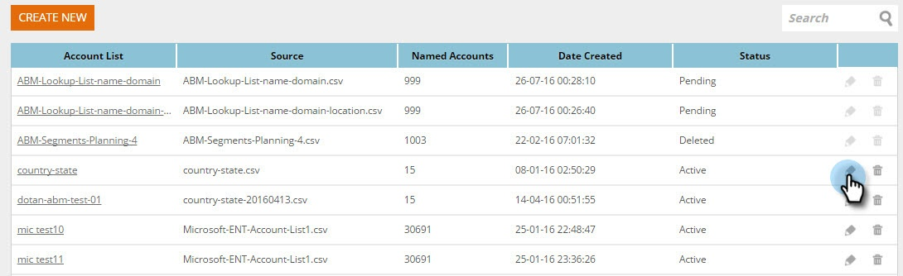
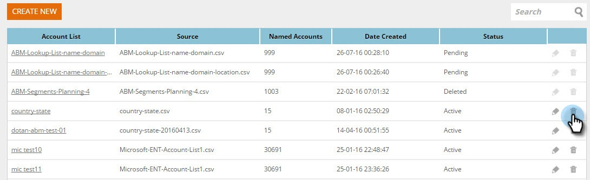

# 创建新帐户列表 {#create-a-new-account-list}

创建并上传组织和域名列表，以通过个性化的促销活动定位这些关键帐户。

>[!NOTE]
>
>本文仅适用于旧版Web ABM客户。 如果您在2016年9月之后购买了Web ABM，请按照 [本文](https://docs.marketo.com/display/DOCS/Account+Lists#AccountLists-CreateaNewAccountList) 而是。

## 创建新帐户列表 {#create-a-new-account-list-1}

1. 转到 **帐户列表**.

   

1. 选择 **新建**.

   

1. 选择 **浏览** 并上传CSV文件（确保csv文件符合条件）。 添加 **名称** 和 **描述**. 单击 **保存**.

   

   >[!NOTE]
   >
   >**CSV文件的格式是什么？**
   >
   >确保指定帐户CSV文件满足以下要求：
   >
   >* 另存为CSV格式
   >* 不超过10MB
   >* 只有标题列A：名称，列B：域，列C：国家/地区，列D：美国州4列。
   >* 上传的文件最多需要2个工作日才能获得批准。
   >* 您将收到一封批准电子邮件通知，或在“指定帐户”页面中检查文件的状态。
   >* 对于上载的所有列表，累计的记录总数/行数从1万开始计数，最大程序包总计为10万。

   >[!NOTE]
   >
   >**CSV文件示例**
   >
   >* 行1列A值=组织
   >* 行1列B值=域
   >* 行1列C值=国家/地区
   >* 行1列D值=美国各州
   >* 其中一个列值是必需的。 但是，同时提供“组织”和“域名”可以提高帐户列表的匹配率。
   >* “国家/地区”和“州/省”为可选值。
   >
   >   * 对于国家/地区名称，请使用完整的国家/地区名称或缩写代码。 例如： 美国或美国。
   >   * 对于美国各州，使用由2个字母组成的缩写代码，即CA。 只有美国的州才被承认。
   >
   >

## 编辑帐户列表 {#edit-an-account-list}

在 **帐户列表** 页面上，单击 **编辑** 图标。

选择 **浏览** 并上传新的CSV文件。 此文件将替换原始文件。 单击 **保存**. 新上传的文件将处于待处理状态，直到Marketo支持批准为止，当处于待处理状态时，原始文件将保持活动状态。

CSV文件将替换现有文件。 在新文件处理完成之前，现有列表将保持活动状态。

## 删除指定帐户列表 {#delete-a-named-account-list}

1. 在 **帐户列表** 页面上，单击要删除的列表的删除图标。

   

1. 此时将显示一条消息，确认您是否要删除该列表。 单击 **确定**.

   

>[!MORELIKETHIS]
>
>[使用帐户列表创建区段](/help/marketo/product-docs/web-personalization/account-based-web-marketing/create-a-segment-using-an-account-list.md)
