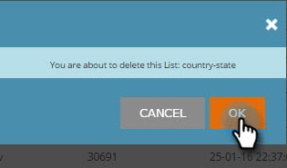

# 创建新帐户列表 {#create-a-new-account-list}

创建并上传组织和域名列表，以通过个性化促销活动定位这些关键帐户。

>[!NOTE]
>
>本文仅适用旧版Web ABM客户。 如果您在2016年9月后获得Web ABM，请按照 [本文](https://docs.marketo.com/display/DOCS/Account+Lists#AccountLists-CreateaNewAccountList) 中。

## 创建新帐户列表 {#create-a-new-account-list-1}

1. 转到 **帐户列表**.

   

1. 选择 **新建**.

   

1. 选择 **浏览** 并上传CSV文件（确保csv文件符合标准）。 添加 **名称** 和 **描述**. 单击 **保存**.

   

   >[!NOTE]
   >
   >**CSV文件的格式是什么？**
   >
   >确保指定的帐户CSV文件满足以下要求：
   >
   >* 另存为CSV格式
   >* 不超过10MB
   >* 标题列A只有4列：名称，列B:域，列C:国家/地区，D栏：美国各州。
   >* 上传的文件最长可能需要2个工作日才能获得批准。
   >* 您将在“指定帐户”页面中收到批准电子邮件通知或检查文件状态。
   >* 所有上载列表的记录/行总数从10K开始，其中最大的包总数为100K。

   >[!NOTE]
   >
   >**CSV文件的示例**
   >
   >* 行1列A值=组织
   >* Row 1 Column B值= Domain
   >* 行1列C值=国家/地区
   >* 行1列D值=美国州
   >* 其中一个列值是必填的。 但是，提供组织和域名会提高帐户列表的匹配率。
   >* 国家/地区和州是可选值。
      >
      >   * 对于国家/地区名称，请使用完整的国家/地区名称或缩写代码。 例如 美国或美国。
      >   * 对于美国州，请使用双字母的缩写代码，即CA。 只有美国各州得到承认。

   >
   >

## 编辑帐户列表 {#edit-an-account-list}

在 **帐户列表** 页面，单击 **编辑** 图标。

选择 **浏览** ，然后上传新的CSV文件。 此文件将替换原始文件。 单击 **保存**. 新上传的文件将处于待处理状态，直到Marketo支持部门批准为止，当处于待处理状态时，原始文件将保持活动状态。

CSV文件将替换现有文件。 在处理完新文件之前，现有列表将保持活动状态。

## 删除指定帐户列表 {#delete-a-named-account-list}

1. 在 **帐户列表** ，请单击要删除的列表的删除图标。

   

1. 系统会显示一条消息，确认您是否要删除该列表。 单击 **确定**.

   

>[!MORELIKETHIS]
>
>[使用帐户列表创建区段](/help/marketo/product-docs/web-personalization/account-based-web-marketing/create-a-segment-using-an-account-list.md)
