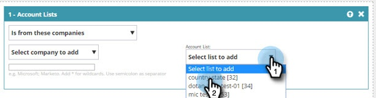

# 使用帐户列表创建区段 {#create-a-segment-using-an-account-list}

Here&#39;s how to create a segment using an Account List.

>[!PREREQUISITES]
>
>[Create a New Account List](/help/marketo/product-docs/target-account-management/target/account-lists.md)

>[!NOTE]
>
>The ability to see Account Lists within Web Personalization requires an additional module called &quot;Web ABM&quot;. If you do not see Account Lists as an option, reach out to the Adobe Account Team (your account manager) for assistance.

1. 前往 **[!UICONTROL Segments]**。

   

1. 单击 **[!UICONTROL Create New]**。

   

1. Enter a name for the segment. Drag and drop **[!UICONTROL Account Lists]** from the **[!UICONTROL Firmographics]** section.

   

1. Select an Account List from the list of named accounts you&#39;ve uploaded. The number in brackets next to the Account List Name is the ID of the List for API reference.

   

   >[!NOTE]
   >
   >Account Lists are synced from ABM to Web Personalization for use in Segmentation. Select them from the drop-down. The sync can take up to five minutes. It will only sync if there are one or more Named Accounts in the Account List.

1. Click **[!UICONTROL Save]**, or click **[!UICONTROL Save & Define Campaign]** to go to the Campaigns page.

   

恭喜！ You&#39;ve now set up a segment targeting an Account List.
