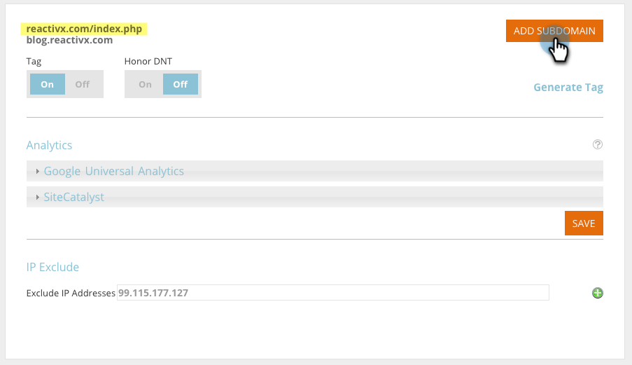

# 在帐户设置中添加子域 {#add-subdomains-in-account-settings}

以下是如何在“帐户设置”中将子域添加到主域。 这将允许您管理与主域的特定RTP Javascript相关的子域。 建议将Javascript标记部署到任何添加的子域。

1. 在Web个性化中，转到 **帐户设置**.

   

1. 在域配置页面上，您将看到与您的帐户关联的所有主域的列表。 每个部分首先列出主域（在下面突出显示），然后列出任何子域。 单击 **添加子域**.

   

1. 单击 **添加**.

   

1. 输入子域URL。 单击 **添加** 或 **删除** 要管理子域列表，请单击 **确定** 等你完事了。

   

1. 您新添加的子域现在将列出。

   

   >[!NOTE]
   >
   >如果要添加 _主要_ 域到您的帐户，请联系 [Marketo支持](https://nation.marketo.com/t5/Support/ct-p/Support).
