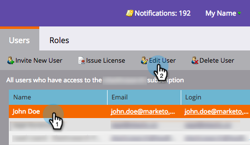

# 登录名和用户管理{#login-and-user-management}

## 创建Web个性化用户角色{#create-a-web-personalization-user-role}

1. 转到&#x200B;**Admin**&#x200B;部分，然后单击&#x200B;**用户和角色**。

   

1. 单击&#x200B;**角色**。

   

   >[!NOTE]
   >
   >如果Web个性化(WP)用户角色已存在，请确保已按照步骤4中的说明进行配置。

1. 单击&#x200B;**新建角色**。

   

1. 输入角色名称并选择权限。 单击&#x200B;**创建**（此角色必须[应用于所有工作区](http://docs.marketo.com/display/DOCS/Managing+Marketo+Users#ManagingMarketoUsers-CreateUsers)）。

   

   >[!TIP]
   >
   >要向用户授予访问定位和个性化中所有内容的权限，请确保选中&#x200B;*all*&#x200B;复选框。

## Web个性化和预测性内容用户权限{#web-personalization-and-predictive-content-user-permissions}

**定位和个性化**:如果仅选择了此权限，则用户只具有视图权限。

**Admin Web Personalization + Predictive**:用户只能访问Web个性化和预测内容应用程序的帐户设置和内容设置。用户可以视图应用程序中的页面，但没有创建、编辑、删除和启动权限。

**预测性内容编辑器**:用户具有对预测内容应用程序的编辑者访问权限。该权限允许创建、编辑和删除内容片段。 它不允许在Web或电子邮件上启用用于预测的内容。

**预测内容启动器**:用户有权访问除帐户和内容设置之外的所有预测内容功能。该权限允许创建、编辑和删除内容以及启用内容片段。

**Web活动编辑器**:用户有权访问所有Web个性化功能以创建、编辑和删除Web活动，但不能启动Web个性化。

**Web活动启动器**:用户有权访问除“帐户”和“内容设置”之外的所有Web个性化应用程序功能。该权限允许创建、编辑、删除和启动Web活动。

## 为用户{#assign-wp-role-to-user}分配WP角色

1. 转至&#x200B;**用户**。

   

1. 选择要授予WP访问权限的用户，然后单击“编辑用户”**。**

   

1. 为所有工作区选择WP用户角色。

   

1. 新启用的用户在下次登录时将在我的Market中看到&#x200B;**Web Personalization**&#x200B;拼贴。

   
