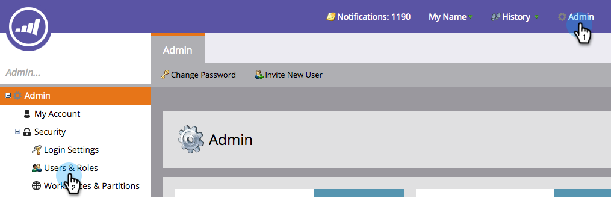

# 登录和用户管理 {#login-and-user-management}

## 创建Web个性化用户角色 {#create-a-web-personalization-user-role}

1. 转到 **管理员** ，然后单击 **用户和角色**.

   

1. 单击 **角色**.

   

   >[!NOTE]
   >
   >如果Web个性化(WP)用户角色已存在，请确保按照步骤4中所示对其进行配置。

1. 单击 **新角色**.

   

1. 输入角色名称并选择权限。 单击 **创建** (此角色必须 [应用于所有工作区](/help/marketo/product-docs/administration/users-and-roles/managing-marketo-users.md))。

   

   >[!TIP]
   >
   >要授予用户访问定位和个性化中所有内容的权限，请务必选择 _全部_ 复选框。

## Web个性化和预测内容用户权限 {#web-personalization-and-predictive-content-user-permissions}

**定位和个性化**:如果仅选择此权限，则用户仅具有查看权限。

**管理Web个性化+预测**:用户只能访问Web个性化和预测内容应用程序的帐户设置和内容设置。 用户可以在应用程序中查看页面，但没有创建、编辑、删除和启动权限。

**预测内容编辑器**:用户具有对预测内容应用程序的编辑者访问权限。 该权限允许创建、编辑、删除内容片段。 不允许在Web或电子邮件上启用用于预测的内容。

**预测内容启动器**:用户有权访问除“帐户”和“内容设置”之外的所有“预测内容”功能。 该权限允许创建、编辑和删除内容片段并启用这些内容片段。

**Web Campaign编辑器**:用户具有所有Web个性化功能的编辑者访问权限，以创建、编辑和删除Web营销活动，但不能启动Web营销活动。

**Web Campaign启动器**:用户有权访问除“帐户”和“内容设置”之外的所有Web个性化应用程序功能。 该权限允许创建、编辑、删除和启动Web营销活动。

## 将WP角色分配给用户 {#assign-wp-role-to-user}

1. 转到 **用户**.

   

1. 选择要授予WP访问权限的用户，然后单击 **编辑用户**.

   

1. 为所有工作区选择WP用户角色。

   

1. 新启用的用户将看到 **Web个性化** 图块。

   
