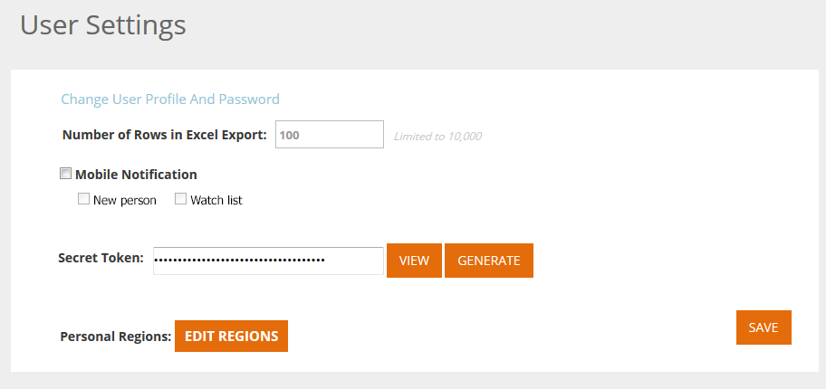

# 用户设置 {#user-settings}

更改时区或Web个性化电子邮件报表等设置。

## 用户配置文件/密码/时区 {#user-profile-passwords-time-zones}

1. 单击您的名称并选择 **用户设置**.

   

1. 此时将显示“用户设置”页面。

   

   在“用户设置”页面上，您可以：

   * 更改您的电子邮件地址
   * 添加个人详细信息（名字和姓氏、手机号码和时区）
   * 选择在平台中导出表时要导出的行数。 请参阅字段：&quot;Excel导出中的最大行数（限制为10,000行）&quot;
   * 为与移动设备应用程序相关的新人员或监视列表选择移动设备通知
   * 通过单击 **编辑区域**.
   * 更改密码
   * 为有关组织、人员、营销活动和资产性能的电子邮件报表选择电子邮件报表通知设置

   单击 **保存** 进行任何更改后，Analytics会立即删除。

   >[!NOTE]
   >
   >选择您的区域将仅显示与来自定义区域的组织和人员相关的数据并发送电子邮件报告。

## 选择电子邮件报表 {#select-email-reports}

选择 [电子邮件报告](/help/marketo/product-docs/web-personalization/reporting-for-web-personalization/email-reports.md) 与用户关联，以及发送报表的频率（每日、每周或每季）。

>[!NOTE]
>
>单击 **保存** 不会退出“用户设置”。 要退出，请单击左上角的Marketo徽标，然后选择您的目标。

>[!MORELIKETHIS]
>
>[编辑区域](/help/marketo/product-docs/web-personalization/getting-started/edit-regions.md)
