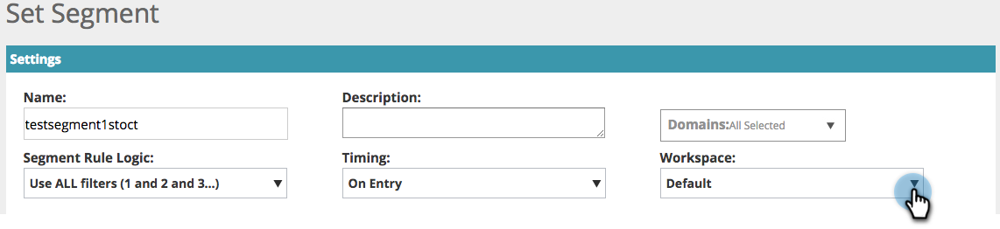

# [!UICONTROL Web Personalization]中的工作区 {#workspaces-in-web-personalization}

[!UICONTROL Web Personalization]支持Web营销活动和Web区段的多个工作区。

## 切换工作区 {#switch-workspaces}

要在Web个性化中的工作区之间进行切换，请单击左上角的地球图标，然后从下拉列表中选择不同的工作区。

## 更改区段的Workspace {#change-a-segments-workspace}

1. 转到&#x200B;**[!UICONTROL Segments]**&#x200B;页面，选择一个区段，然后单击编辑图标。

   

1. 从&#x200B;**[!UICONTROL Workspace]**&#x200B;下拉列表中选择其他工作区。

   

   

>[!NOTE]
>
>用户将只能查看与其有权访问的工作区相关联的Web营销活动和区段。 下面是如何[授予用户访问一个或多个工作区的权限](/help/marketo/product-docs/administration/workspaces-and-person-partitions/allow-user-access-to-a-workspace.md)。
