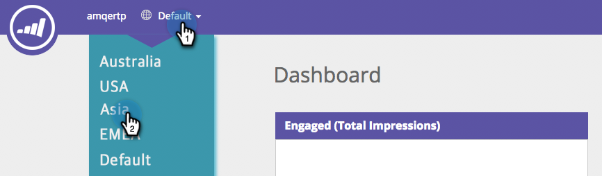

# Web个性化中的工作区 {#workspaces-in-web-personalization}

Web个性化支持Web营销活动和Web区段的多个工作区。

## 切换工作区 {#switch-workspaces}

要在Web个性化中的工作区之间切换，请单击左上角的地球图标，然后从下拉列表中选择其他工作区。

## 更改区段的工作区 {#change-a-segments-workspace}

1. 转到 **区段** ，选择一个区段，然后单击编辑图标。

   

1. 从 **工作区** 下拉菜单。

   

   

>[!NOTE]
>
>用户将只能查看与他们有权访问的工作区关联的Web营销活动和区段。 下面是如何 [为用户授予一个或多个工作区的访问权限](/help/marketo/product-docs/administration/workspaces-and-person-partitions/allow-user-access-to-a-workspace.md).
