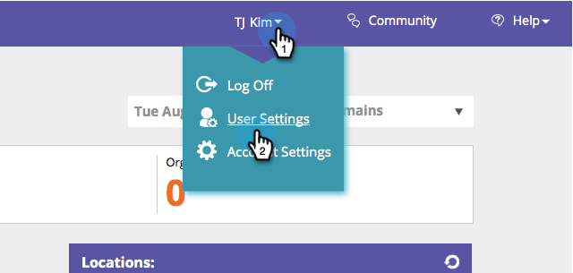

# 启用/禁用报告订阅{#enable-disable-report-subscriptions}

Web个性化包含几个通过电子邮件发送的有用报表。 下面将介绍如何订阅它们。

1. 登录Web个性化。 在登录名下，单击&#x200B;**用户设置**。

   

1. 选择要订阅的报告及其频率。 单击&#x200B;**保存**。

   

   就这样！ 要取消订阅报表，只需取消选中并单击&#x200B;**保存**。
