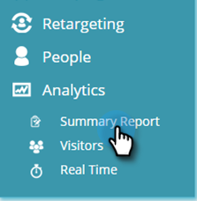

# 了解摘要报表 {#understanding-the-summary-report}

“摘要”报表是所有营销活动和推荐内容效果的每月视图。 它基于参与个性化促销活动或推荐内容的点击次数和潜在客户（直接或协助）数量，然后成为已知潜在客户。 报表会将结果与上个月进行比较。

>[!NOTE]
>
>**条件**
>
>直接转化：在同一访问会话中单击个性化促销活动或推荐内容资产的Web访客，会继续使用其电子邮件地址填写网站上的任何表单。
>
>辅助转化：在网站上填写任何表单并保留其电子邮件地址的Web访客，在上次访问（过去6个月内）中单击了个性化促销活动或推荐的内容资产。

在Web个性化中，转到 **Analytics** 和 **摘要报表**.

选择 **月** 单击 **显示报表**.

报表的第一部分与个性化Web个性化促销活动和显示相关：

* **点击次数**  — 对Web个性化促销活动的所有点击
* **直接转化**  — 访问期间点击了Web个性化促销活动并填写了表单的所有访客
* **直接转化率**  — 点击Web个性化促销活动后成为直接潜在客户的访客百分比。 直接潜在客户除以点击量
* **辅助转化**  — 在上一次访问（过去6个月中）中填写表单并点击了Web个性化促销活动的所有访客
* **提示**  — 优化Web个性化促销活动性能的提示
* **热门营销活动**  — 按点击次数排序的选定时间段内效果最佳的营销活动

报表的第二部分与Web个性化内容推荐引擎中的推荐内容相关。 它显示：

* **点击次数**  — 对Web个性化推荐内容的所有点击
* **直接转化**  — 在访问期间点击推荐内容并填写表单的所有访客
* **直接转化率**  — 单击推荐内容后成为直接潜在客户的访客百分比。 直接潜在客户除以点击量
* **辅助转化**  — 所有在上一次访问（过去6个月）中填写表单并点击推荐内容的访客
* **提示**  — 使用内容推荐引擎优化的提示
* **热门Recommendations**  — 在选定的时间段内，按点击次数排序的性能最佳的推荐内容

>[!NOTE]
>
>Marketo Web Personalization会为网站上填写的任何表单捕获Web访客的电子邮件地址。 该潜在客户可在Web个性化潜在客户页面中查看，它是在摘要报表中使用的潜在客户。
