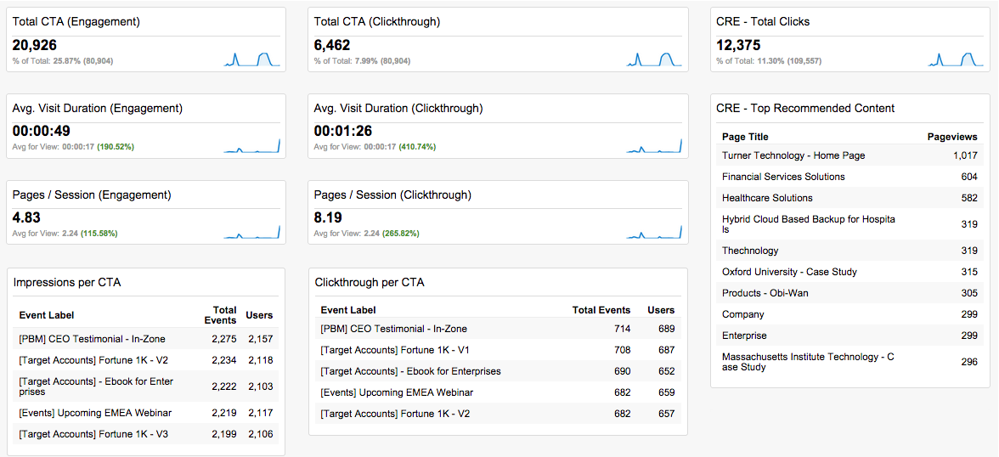

# Google Universal Analytics {#custom-rtp-dashboards-in-google-universal-analytics}中的自定义RTP仪表板

>[!PREREQUISITES]
>
>[将RTP与Google Universal Analytics集成](/help/marketo/product-docs/web-personalization/reporting-for-web-personalization/web-analytics-integrations/integrate-rtp-with-google-universal-analytics.md)

本文介绍如何在Google Universal Analytics(GUA)中设置RTP仪表板。 可以将从RTP发送到GUA的数据设置为两个单独的自定义仪表板:

* RTP B2B
* RTP参与

## 设置自定义仪表板{#setting-up-a-custom-dashboard}

1. 登录Google Analytics。 单击顶部菜单中的&#x200B;**报告**。 单击&#x200B;**仪表板**&#x200B;和&#x200B;**+新建自定义仪表板**。

   

1. 选择&#x200B;**空白画布**，添加&#x200B;**仪表板名称**&#x200B;并单击&#x200B;**创建仪表板**。

1. 单击&#x200B;**添加Widget**&#x200B;以创建新Widget。

   

## RTP B2B仪表板{#rtp-b-b-dashboard}

此仪表板允许用户从B2B角度分析其网站性能。

它按行业、收入、规模、基于帐户的列表和目标细分提供访问源和现场行为等信息。

仪表板包含3列

* 流量源
* 细分
* Firmographic向下钻取

1. 创建一个名为&#x200B;**RTP B2B仪表板**&#x200B;的新仪表板，并定义以下构件：

<table> 
 <thead> 
  <tr> 
   <th> 
    

      列1 — 流量源
    
</th> 
   <th> 
    
 <strong>列2 — 分段</strong> 
    
</th> 
   <th> 
    
 <strong>第3列 — 向下钻取</strong> 
    
</th> 
  </tr> 
 </thead> 
 <tbody> 
  <tr> 
   <td> 
    <ul> 
     <li>名称：按区段和渠道的会话</li> 
     <li>构件类型：栏 </li> 
     <li>创建条形图，其中显示：会话</li> 
     <li>分组依据：事件标签</li> 
     <li>透视方式：默认渠道分组</li> 
     <li>过滤器： 仅显示 |事件类别（包含）RTP — 段</li> 
    </ul>

</td> 
   <td> 
    <ul> 
     <li>名称：RTP分段用户数</li> 
     <li>类型：2.1量度</li> 
     <li>显示以下量度：用户 </li> 
     <li>过滤器： 仅显示 |事件类别（包含）RTP — 段</li> 
    </ul>

</td> 
   <td> 
    <ul> 
     <li>名称：按行业分类的会议</li> 
     <li>类型：饼 </li> 
     <li>创建一个饼图，其中显示：会话</li> 
     <li>分组依据：RTP工业</li> 
    </ul>

</td> 
  </tr> 
  <tr> 
   <th> 
    <ul> 
     <li><strong>名称：按行业和渠道</strong></li> 
     <li><strong>构件类型：栏</strong></li> 
     <li><strong>创建条形图，其中显示：会话</strong></li> 
     <li><strong>分组依据：RTP工业</strong></li> 
     <li><strong>透视方式：默认渠道分组</strong> </li> 
    </ul></th> 
   <th> 
    <ul> 
     <li><strong>名称：按国家/地区划分的会话</strong></li> 
     <li><strong>类型：Geomap</strong></li> 
     <li><strong>绘制选定量度：国家/地区 |会话</strong></li> 
     <li><strong>选择区域：世界</strong></li> 
     <li><strong>过滤器：仅显示 |事件类别（包含）RTP — 段</strong></li> 
    </ul>

</th> 
   <th> 
    <ul> 
     <li><strong>名称：按RTP类别的会话</strong></li> 
     <li><strong>类型：饼</strong></li> 
     <li><strong>创建一个饼图，其中显示：会话</strong></li> 
     <li><strong>分组依据：RTP类别</strong></li> 
    </ul>

</th> 
  </tr> 
  <tr> 
   <th> </th> 
   <th> 
    <ul> 
     <li>名称：热门目标细分</li> 
     <li>类型：栏</li> 
     <li>创建条形图，其中显示：用户</li> 
     <li>分组依据：事件操作</li> 
     <li>过滤器：仅显示 |事件类别（包含）RTP — 段</li> 
    </ul>

</th> 
   <th> 
    <ul> 
     <li>名称：按RTP组的会话</li> 
     <li>类型：栏 </li> 
     <li>创建条形图，其中显示：会话</li> 
     <li>分组依据：RTP组</li> 
    </ul>
<strong></strong>
</th> 
  </tr> 
  <tr> 
   <th> </th> 
   <th> 
    <ul> 
     <li>名称：按热门细分的会话和目标</li> 
     <li>类型：表 </li> 
     <li>显示以下列： 事件标签 |会话 |目标转化率</li> 
     <li>过滤器： 仅显示 |事件类别（包含）RTP — 段</li> 
    </ul>
<strong></strong>
</th> 
   <th> </th> 
  </tr> 
 </tbody> 
</table>

## RTP参与仪表板{#rtp-engagement-dashboard}

此仪表板允许用户分析其RTP活动性能和推荐引擎参与。 它提供了平均值的比较 会话持续时间和每个会话的页面：

* 未参与
* 参与(个性化活动上的展示和点击)
* 单击推荐引擎和顶级推荐内容

新建一个名为&#x200B;**RTP参与仪表板**&#x200B;的仪表板，并定义以下构件：

<table> 
 <thead> 
  <tr> 
   <th> 
    
 <strong>第1列活动曝光</strong> 
    
</th> 
   <th> 
    
 <strong>第2列活动点进</strong> 
    
</th> 
   <th> 
    
 <strong>第3列推荐引擎</strong> 
    
</th> 
  </tr> 
 </thead> 
 <tbody> 
  <tr> 
   <td> 
    <ul> 
     <li>名称：<strong>总CTA（参与）</strong></li> 
     <li>类型：<strong>2.1量度</strong></li> 
     <li>显示以下量度：<strong>总事件</strong></li> 
     <li>过滤器: <strong>[仅显示]事件类别（包含）：RTP-活动s</strong> <strong>[仅显示]事件操作（完全匹配）：印象</strong><strong>[不显示]事件标签（包含）：#</strong></li> 
    </ul>
<strong></strong>
</td> 
   <td> 
    <ul> 
     <li>名称：<strong>总CTA（点进率）</strong></li> 
     <li>类型：<strong>2.1量度</strong></li> 
     <li>显示以下量度：<strong>总事件</strong></li> 
     <li>过滤器: <strong>[仅显示]事件类别（包含）：RTP-活动s</strong> <strong>[仅显示]事件操作（完全匹配）：单击</strong><strong>[不显示]事件标签（包含）：#</strong></li> 
    </ul>
<strong></strong>
</td> 
   <td> 
    <ul> 
     <li>名称：<strong>CRE — 总点击量</strong></li> 
     <li>类型：<strong>2.1量度</strong> </li> 
     <li>显示以下量度：<strong>Pageviews</strong></li> 
     <li>过滤器：<strong>[仅显示]页（包含）：rcmd</strong></li> 
    </ul>

</td> 
  </tr> 
  <tr> 
   <td colspan="1"> 
    <ul> 
     <li>名称：<strong>平均 会话持续时间（参与）</strong></li> 
     <li>类型：<strong>2.1量度</strong></li> 
     <li>显示以下量度：<strong>平均 会话持续时间</strong></li> 
     <li>过滤器: <strong>[仅显示]事件类别（完全匹配）：RTP-活动s</strong> <strong>[仅显示]事件操作（完全匹配）：印象</strong><strong>[不显示]事件标签（包含）：#</strong></li> 
    </ul>
<strong></strong>
</td> 
   <td colspan="1"> 
    <ul> 
     <li>名称：<strong>平均 会话持续时间（点进率）</strong></li> 
     <li>类型：<strong>2.1量度</strong></li> 
     <li>显示以下量度：<strong>平均 会话持续时间</strong></li> 
     <li>过滤器: <strong>[仅显示]事件类别（完全匹配）：RTP-活动s</strong> <strong>[仅显示]事件操作（完全匹配）：单击</strong><strong>[不显示]事件标签（包含）：#</strong></li> 
    </ul>
<strong></strong>
</td> 
   <td colspan="1"> 
    <ul> 
     <li>名称：<strong>CRE — 推荐的顶级内容</strong></li> 
     <li>类型：<strong>表</strong> </li> 
     <li>显示以下列： <strong>页面标题 | Pageviews</strong> </li> 
     <li>过滤器: 筛选器：<strong>[仅显示]页面（包含）：rcmd</strong></li> 
    </ul>

</td> 
  </tr> 
  <tr> 
   <td> 
    <ul> 
     <li>名称：<strong>页面/会话（参与）</strong></li> 
     <li>类型：<strong>2.1量度</strong></li> 
     <li>显示以下量度：<strong>页面/会话</strong></li> 
     <li>过滤器: <strong>[仅显示]事件类别（完全匹配）：RTP-活动</strong></li> 
     <li><strong>[仅显示]事件操作（完全匹配）：印象</strong></li> 
     <li><strong>[不显示]事件标签（包含）：#</strong></li> 
    </ul>

</td> 
   <td> 
    <ul> 
     <li>名称：<strong>页面/会话（点进）</strong></li> 
     <li>类型：<strong>2.1量度</strong></li> 
     <li>显示以下量度：<strong>页面/会话</strong></li> 
     <li>过滤器: <strong>[仅显示]事件类别（完全匹配）：RTP-活动</strong></li> 
     <li><strong>[仅显示]事件操作（完全匹配）：单击</strong></li> 
     <li><strong>[不显示]事件标签（包含）：#</strong></li> 
    </ul>
<strong></strong>
</td> 
   <td> </td> 
  </tr> 
  <tr> 
   <td> 
    <ul> 
     <li>名称：<strong>CTA的展示次数</strong></li> 
     <li>类型：<strong>表</strong></li> 
     <li>显示以下列：<strong>事件标签 |总事件 | Users</strong></li> 
     <li>过滤器: <strong>[仅显示]事件类别（完全匹配）：RTP-活动s</strong> <strong>[仅显示]事件操作（完全匹配）：印象</strong><strong>[不显示]事件标签（包含）：#</strong></li> 
    </ul>

</td> 
   <td> 
    <ul> 
     <li>名称：<strong>点进率CTA</strong></li> 
     <li>类型：<strong>表</strong></li> 
     <li>显示以下列：<strong>事件标签 |总事件 | Users</strong></li> 
     <li>过滤器: <strong>[仅显示]事件类别（完全匹配）：RTP-活动s</strong> <strong>[仅显示]事件操作（完全匹配）：clicks</strong></li> 
    </ul>

</td> 
   <td> </td> 
  </tr> 
 </tbody> 
</table>

>[!MORELIKETHIS]
>
>[将RTP与Google Universal Analytics集成](/help/marketo/product-docs/web-personalization/reporting-for-web-personalization/web-analytics-integrations/custom-rtp-reports-in-google-universal-analytics.md)
>
>[Google Universal Analytics中的自定义RTP报表](/help/marketo/product-docs/web-personalization/reporting-for-web-personalization/web-analytics-integrations/custom-rtp-reports-in-google-universal-analytics.md)
