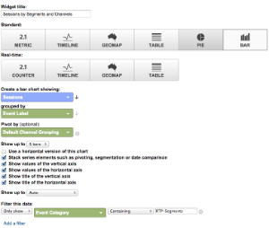
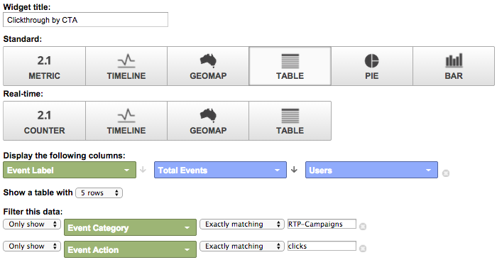

# Google Universal Analytics中的自定义RTP功能板 {#custom-rtp-dashboards-in-google-universal-analytics}

>[!PREREQUISITES]
>
>[将RTP与Google Universal Analytics集成](/help/marketo/product-docs/web-personalization/reporting-for-web-personalization/web-analytics-integrations/integrate-rtp-with-google-universal-analytics.md)

本文说明如何在Google Universal Analytics (GUA)中设置RTP功能板。 从RTP发送到GUA的数据可以设置为两个单独的自定义仪表板，称为：

* RTP B2B
* RTP参与

## 设置自定义仪表板 {#setting-up-a-custom-dashboard}

1. 登录到Google Analytics。 单击顶部菜单中的&#x200B;**[!UICONTROL Reporting]**。 单击&#x200B;**[!UICONTROL Dashboards]**&#x200B;和&#x200B;**[!UICONTROL New Dashboard]**。

   

1. 选择&#x200B;**空白画布**，添加&#x200B;**仪表板名称**，然后单击&#x200B;**[!UICONTROL Create Dashboard]**。

1. 单击&#x200B;**[!UICONTROL Add Widget]**&#x200B;以创建新构件。

   

## RTP B2B仪表板 {#rtp-b-b-dashboard}

此仪表板允许用户从B2B角度分析其网站性能。

它按行业、收入、规模、基于帐户的列表和目标区段提供访问来源和现场行为等信息。

仪表板由3列组成

* 流量源
* 区段
* 第一层向下扩展

1. 创建一个名为&#x200B;**RTP B2B仪表板**&#x200B;的新仪表板，并定义以下小组件：

<table>
 <thead>
  <tr>
   <th>
    

      列1 — 流量源
    
</th>
   <th>
    
 <strong>列2 — 分段</strong>
    
</th>
   <th>
    
 <strong>列3 — 第一层向下钻取</strong>
    
</th>
  </tr>
 </thead>
 <tbody>
  <tr>
   <td>
    <ul>
     <li>名称：按区段和渠道显示的会话</li>
     <li>构件类型：栏 </li>
     <li>创建一个显示：会话的条形图</li>
     <li>按分组： 事件标签</li>
     <li>透视依据：默认渠道分组</li>
     <li>筛选器： 仅显示 | 事件类别 （包含） RTP区段</li>
    </ul>

</td>
   <td>
    <ul>
     <li>名称：RTP分段用户的数量</li>
     <li>类型： 2.1指标</li>
     <li>显示以下量度： 用户 </li>
     <li>筛选器： 仅显示 | 事件类别 （包含）RTP段</li>
    </ul>

</td>
   <td>
    <ul>
     <li>名称：按行业划分的会话</li>
     <li>类型： 饼图 </li>
     <li>创建一个饼图，其中显示： 会话</li>
     <li>按分组：RTP-Industry</li>
    </ul>

</td>
  </tr>
  <tr>
   <th>
    <ul>
     <li><strong>名称：按行业和渠道划分的会话</strong></li>
     <li><strong>构件类型：栏</strong></li>
     <li><strong>创建一个显示：会话的条形图</strong></li>
     <li><strong>分组依据： RTP-Industry</strong></li>
     <li><strong>透视依据：默认渠道分组</strong> </li>
    </ul></th>
   <th>
    <ul>
     <li><strong>名称：按国家/地区分段会话</strong></li>
     <li><strong>类型： Geomap</strong></li>
     <li><strong>绘制所选量度： 国家/地区 | 个会话</strong></li>
     <li><strong>选择区域：世界</strong></li>
     <li><strong>筛选器：仅显示 | 事件类别 （包含）RTP段</strong></li>
    </ul>

</th>
   <th>
    <ul>
     <li><strong>名称：按RTP类别显示的会话</strong></li>
     <li><strong>类型： 饼图</strong></li>
     <li><strong>创建一个饼图，其中显示： 会话</strong></li>
     <li><strong>按分组： RTP类别</strong></li>
    </ul>

</th>
  </tr>
  <tr>
   <th> </th>
   <th>
    <ul>
     <li>名称：热门目标区段</li>
     <li>类型： 栏</li>
     <li>创建一个显示： 用户的条形图</li>
     <li>按分组： 事件操作</li>
     <li>筛选器：仅显示 | 事件类别 （包含）RTP段</li>
    </ul>

</th>
   <th>
    <ul>
     <li>名称：按RTP组排列的会话</li>
     <li>类型：条形图 </li>
     <li>创建条形图，其中显示：会话</li>
     <li>分组依据： RTP-Group</li>
    </ul>

</th>
  </tr>
  <tr>
   <th> </th>
   <th>
    <ul>
     <li>名称：按热门区段划分的会话和目标</li>
     <li>类型：表 </li>
     <li>显示以下列： 事件标签 | 会话 | 目标转化率</li>
     <li>筛选器： 仅显示 | 事件类别（包含）RTP区段</li>
    </ul>

</th>
   <th> </th>
  </tr>
 </tbody>
</table>

## RTP参与仪表板 {#rtp-engagement-dashboard}

利用此仪表板，用户可分析其RTP促销活动绩效和推荐引擎参与情况。 它提供了平均值的比较。 会话持续时间和每个会话页数介于：

* 未参与
* 参与次数（个性化营销活动的展示次数和点击次数）
* 推荐引擎和主要推荐内容的点击量

创建一个名为&#x200B;**RTP参与仪表板**&#x200B;的新仪表板，并定义以下小组件：

<table>
 <thead>
  <tr>
   <th>
    
 <strong>列1促销活动曝光度</strong>
    
</th>
   <th>
    
 <strong>列2促销活动点进</strong>
    
</th>
   <th>
    
 <strong>列3推荐引擎</strong>
    
</th>
  </tr>
 </thead>
 <tbody>
  <tr>
   <td>
    <ul>
     <li>名称：<strong>CTA参与总数</strong></li>
     <li>类型： <strong>2.1指标</strong></li>
     <li>显示以下量度：<strong>总事件</strong></li>
     <li>筛选器： <strong>[仅显示]事件类别（包含）： RTP-Campaigns</strong> <strong>[仅显示]事件操作（完全匹配）： Impression</strong>[不显示]事件标签（包含）： #</li>
    </ul>

</td>
   <td>
    <ul>
     <li>名称： <strong>CTA总数（点进）</strong></li>
     <li>类型： <strong>2.1指标</strong></li>
     <li>显示以下量度：<strong>总事件</strong></li>
     <li>筛选器： <strong>[仅显示]事件类别（包含）： RTP-Campaigns</strong> <strong>[仅显示]事件操作（完全匹配）：点击次数</strong><strong>[不显示]事件标签（包含）： #</strong></li>
    </ul>

</td>
   <td>
    <ul>
     <li>名称： <strong>CRE — 总点击次数</strong></li>
     <li>类型： <strong>2.1指标</strong> </li>
     <li>显示以下量度： <strong>页面查看次数</strong></li>
     <li>筛选器： <strong>[仅显示] 页面 （包含）： rcmd</strong></li>
    </ul>

</td>
  </tr>
  <tr>
   <td colspan="1">
    <ul>
     <li>名称： <strong>平均 会话持续时间（参与度）</strong></li>
     <li>类型： <strong>2.1指标</strong></li>
     <li>显示以下量度： <strong>平均 会话持续时间</strong></li>
     <li>筛选器： <strong>[仅显示]事件类别（完全匹配）： RTP-Campaigns</strong> <strong>[仅显示]事件操作（完全匹配）： impression</strong><strong>[不显示]事件标签（包含）： #</strong></li>
    </ul>

</td>
   <td colspan="1">
    <ul>
     <li>名称： <strong>平均 会话持续时间（点进）</strong></li>
     <li>类型： <strong>2.1指标</strong></li>
     <li>显示以下量度： <strong>平均 会话持续时间</strong></li>
     <li>筛选器： <strong>[仅显示]事件类别（完全匹配）： RTP-Campaigns</strong> <strong>[仅显示]事件操作（完全匹配）：点击次数</strong><strong>[不显示]事件标签（包含）： #</strong></li>
    </ul>

</td>
   <td colspan="1">
    <ul>
     <li>名称： <strong>CRE — 最推荐的内容</strong></li>
     <li>类型： <strong>表</strong> </li>
     <li>显示以下列：  <strong>页面标题 | 页面查看次数</strong> </li>
     <li>筛选器： 筛选器： <strong>[仅显示] 页面 （包含）： rcmd</strong></li>
    </ul>

</td>
  </tr>
  <tr>
   <td>
    <ul>
     <li>名称： <strong>页面/会话（参与度）</strong></li>
     <li>类型： <strong>2.1指标 </strong></li>
     <li>显示以下量度：<strong>页/会话</strong></li>
     <li>筛选器： <strong>[仅显示] 事件类别 （完全匹配）： RTP促销活动</strong></li>
     <li><strong>[只显示] 事件操作 （完全匹配）： impression</strong></li>
     <li><strong>[不显示] 事件标签 （包含）： #</strong></li>
    </ul>

</td>
   <td>
    <ul>
     <li>名称： <strong>页面/会话（点进）</strong></li>
     <li>类型： <strong>2.1指标</strong></li>
     <li>显示以下量度：<strong>页面/会话</strong></li>
     <li>筛选器： <strong>[仅显示]事件类别（完全匹配）： RTP — 促销活动</strong></li>
     <li><strong>[仅显示]事件操作（完全匹配）：点击次数</strong></li>
     <li><strong>[不显示]事件标签（包含）： #</strong></li>
    </ul>

</td>
   <td> </td>
  </tr>
  <tr>
   <td>
    <ul>
     <li>名称：<strong>CTA展示次数</strong></li>
     <li>类型： <strong>表</strong></li>
     <li>显示以下列： <strong>事件标签 | 事件总数 | 用户</strong></li>
     <li>筛选器： <strong>[仅显示] 事件类别 （完全匹配）： RTP — 营销活动</strong> <strong>[仅显示] 事件操作 （完全匹配）：展示</strong><strong>[不显示] 事件标签 （包含）： #</strong></li>
    </ul>

</td>
   <td>
    <ul>
     <li>名称：<strong>CTA点进</strong></li>
     <li>类型： <strong>表</strong></li>
     <li>显示以下列： <strong>事件标签 | 事件总数 | 用户</strong></li>
     <li>筛选器： <strong>[仅显示] 事件类别 （完全匹配）： RTP营销活动</strong> <strong>[仅显示] 事件操作 （完全匹配）：点击次数</strong></li>
    </ul>

</td>
   <td> </td>
  </tr>
 </tbody>
</table>

>[!MORELIKETHIS]
>
>[将RTP与Google Universal Analytics集成](/help/marketo/product-docs/web-personalization/reporting-for-web-personalization/web-analytics-integrations/custom-rtp-reports-in-google-universal-analytics.md)
>
>Google Universal Analytics中的[自定义RTP报告](/help/marketo/product-docs/web-personalization/reporting-for-web-personalization/web-analytics-integrations/custom-rtp-reports-in-google-universal-analytics.md)
