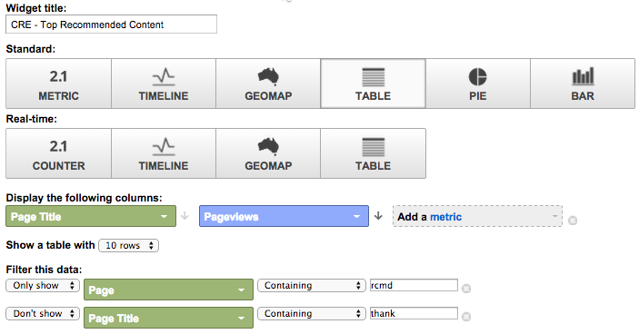

# Google Universal Analytics中的自定义RTP功能板 {#custom-rtp-dashboards-in-google-universal-analytics}

>[!PREREQUISITES]
>
>[将RTP与Google Universal Analytics集成](/help/marketo/product-docs/web-personalization/reporting-for-web-personalization/web-analytics-integrations/integrate-rtp-with-google-universal-analytics.md)

本文介绍如何在Google Universal Analytics(GUA)中设置RTP功能板。 从RTP发送到GUA的数据可以设置为两个单独的自定义功能板，称为：

* RTP B2B
* RTP参与

## 设置自定义功能板 {#setting-up-a-custom-dashboard}

1. 登录Google Analytics。 单击 **报表** 中。 单击 **功能板** 和 **+新建自定义功能板**.

   

1. 选择 **空白画布**，添加 **功能板名称** 单击 **创建功能板**.

1. 单击 **添加小组件** 创建新小组件。

   

## RTP B2B仪表板 {#rtp-b-b-dashboard}

此功能板允许用户从B2B角度分析其网站性能。

它提供了以下信息：按行业、收入、规模、基于帐户的列表和目标区段的访问来源和现场行为。

功能板包含3列

* 流量源
* 分段
* Firmographic向下钻取

1. 创建新功能板，名为 **RTP B2B仪表板** 并定义以下小组件：

<table> 
 <thead> 
  <tr> 
   <th> 
    

      列1 — 流量源
    
</th> 
   <th> 
    
 <strong>列2 — 分段</strong> 
    
</th> 
   <th> 
    
 <strong>列3 - Firmographic向下钻取</strong> 
    
</th> 
  </tr> 
 </thead> 
 <tbody> 
  <tr> 
   <td> 
    <ul> 
     <li>名称：按区段和渠道划分的会话</li> 
     <li>小组件类型：条形图 </li> 
     <li>创建条形图，其中显示：会话</li> 
     <li>分组依据：事件标签</li> 
     <li>引导方式：默认渠道分组</li> 
     <li>过滤器：  仅显示 |事件类别（包含）RTP区段</li> 
    </ul>

</td> 
   <td> 
    <ul> 
     <li>名称：RTP分段用户数</li> 
     <li>类型：2.1量度</li> 
     <li>显示以下量度：用户 </li> 
     <li>过滤器：  仅显示 |事件类别（包含）RTP区段</li> 
    </ul>

</td> 
   <td> 
    <ul> 
     <li>名称：各行业会议</li> 
     <li>类型：派 </li> 
     <li>创建饼图，其中显示：会话</li> 
     <li>分组依据：RTP行业</li> 
    </ul>

</td> 
  </tr> 
  <tr> 
   <th> 
    <ul> 
     <li><strong>名称：按行业和渠道开会</strong></li> 
     <li><strong>小组件类型：条形图</strong></li> 
     <li><strong>创建条形图，其中显示：会话</strong></li> 
     <li><strong>分组依据：RTP行业</strong></li> 
     <li><strong>引导方式：默认渠道分组</strong> </li> 
    </ul></th> 
   <th> 
    <ul> 
     <li><strong>名称：按国家/地区划分的分段会议</strong></li> 
     <li><strong>类型：Geomap</strong></li> 
     <li><strong>绘制选定量度：国家/地区 |会话</strong></li> 
     <li><strong>选择区域：世界</strong></li> 
     <li><strong>过滤器：仅显示 |事件类别（包含）RTP区段</strong></li> 
    </ul>

</th> 
   <th> 
    <ul> 
     <li><strong>名称：按RTP类别开会的会议</strong></li> 
     <li><strong>类型：派</strong></li> 
     <li><strong>创建饼图，其中显示：会话</strong></li> 
     <li><strong>分组依据：RTP类别</strong></li> 
    </ul>

</th> 
  </tr> 
  <tr> 
   <th> </th> 
   <th> 
    <ul> 
     <li>名称：热门目标区段</li> 
     <li>类型：条形图</li> 
     <li>创建条形图，其中显示：用户</li> 
     <li>分组依据：事件操作</li> 
     <li>过滤器：仅显示 |事件类别（包含）RTP区段</li> 
    </ul>

</th> 
   <th> 
    <ul> 
     <li>名称：按RTP分组开会</li> 
     <li>类型：条形图 </li> 
     <li>创建条形图，其中显示：会话</li> 
     <li>分组依据：RTP组</li> 
    </ul>
<strong></strong>
</th> 
  </tr> 
  <tr> 
   <th> </th> 
   <th> 
    <ul> 
     <li>名称：按热门区段划分的会话和目标</li> 
     <li>类型：表 </li> 
     <li>显示以下列：  事件标签 |会话 |目标转化率</li> 
     <li>过滤器：  仅显示 |事件类别（包含）RTP区段</li> 
    </ul>
<strong></strong>
</th> 
   <th> </th> 
  </tr> 
 </tbody> 
</table>

## RTP参与控制板 {#rtp-engagement-dashboard}

此功能板允许用户分析其RTP促销活动效果和推荐引擎参与情况。 它提供了平均值的比较 会话持续时间和每个会话的页面介于以下之间：

* 未参与
* 参与（个性化促销活动的展示次数和点击次数）
* 单击推荐引擎和热门推荐内容

创建新功能板，名为 **RTP参与控制板** 并定义以下小组件：

<table> 
 <thead> 
  <tr> 
   <th> 
    
 <strong>第1栏营销活动曝光</strong> 
    
</th> 
   <th> 
    
 <strong>第2列营销活动点进</strong> 
    
</th> 
   <th> 
    
 <strong>第3栏推荐引擎</strong> 
    
</th> 
  </tr> 
 </thead> 
 <tbody> 
  <tr> 
   <td> 
    <ul> 
     <li>名称： <strong>总CTA（参与度）</strong></li> 
     <li>类型： <strong>2.1量度 </strong></li> 
     <li>显示以下量度： <strong>事件总数</strong></li> 
     <li>过滤器： <strong>[仅显示]事件类别（包含）：RTP-Campaigns</strong> <strong>[仅显示]事件操作（完全匹配）：展示</strong><strong>[不显示]事件标签（包含）：#</strong></li> 
    </ul>
<strong></strong>
</td> 
   <td> 
    <ul> 
     <li>名称： <strong>总CTA（点进）</strong></li> 
     <li>类型： <strong>2.1量度 </strong></li> 
     <li>显示以下量度： <strong>事件总数</strong></li> 
     <li>过滤器： <strong>[仅显示]事件类别（包含）：RTP-Campaigns</strong> <strong>[仅显示]事件操作（完全匹配）：点击次数</strong><strong>[不显示]事件标签（包含）：#</strong></li> 
    </ul>
<strong></strong>
</td> 
   <td> 
    <ul> 
     <li>名称： <strong>CRE — 总点击量</strong></li> 
     <li>类型： <strong>2.1量度</strong> </li> 
     <li>显示以下量度： <strong>页面查看次数</strong></li> 
     <li>过滤器： <strong>[仅显示]页面（包含）：rcmd</strong></li> 
    </ul>

</td> 
  </tr> 
  <tr> 
   <td colspan="1"> 
    <ul> 
     <li>名称： <strong>平均 会话持续时间（参与度）</strong></li> 
     <li>类型： <strong>2.1量度 </strong></li> 
     <li>显示以下量度： <strong>平均 会话持续时间</strong></li> 
     <li>过滤器： <strong>[仅显示]事件类别（完全匹配）：RTP-Campaigns</strong> <strong>[仅显示]事件操作（完全匹配）：印象</strong><strong>[不显示]事件标签（包含）：#</strong></li> 
    </ul>
<strong></strong>
</td> 
   <td colspan="1"> 
    <ul> 
     <li>名称： <strong>平均 会话持续时间（点进）</strong></li> 
     <li>类型： <strong>2.1量度 </strong></li> 
     <li>显示以下量度： <strong>平均 会话持续时间</strong></li> 
     <li>过滤器： <strong>[仅显示]事件类别（完全匹配）：RTP-Campaigns</strong> <strong>[仅显示]事件操作（完全匹配）：点击</strong><strong>[不显示]事件标签（包含）：#</strong></li> 
    </ul>
<strong></strong>
</td> 
   <td colspan="1"> 
    <ul> 
     <li>名称： <strong>CRE — 主要推荐内容</strong></li> 
     <li>类型： <strong>表</strong> </li> 
     <li>显示以下列：  <strong>页面标题 |页面查看次数</strong> </li> 
     <li>过滤器： 过滤器： <strong>[仅显示]页面（包含）：rcmd</strong></li> 
    </ul>

</td> 
  </tr> 
  <tr> 
   <td> 
    <ul> 
     <li>名称： <strong>页面/会话（参与度）</strong></li> 
     <li>类型： <strong>2.1量度 </strong></li> 
     <li>显示以下量度： <strong>页面/会话</strong></li> 
     <li>过滤器： <strong>[仅显示]事件类别（完全匹配）：RTP-Campaigns</strong></li> 
     <li><strong>[仅显示]事件操作（完全匹配）：印象</strong></li> 
     <li><strong>[不显示]事件标签（包含）：#</strong></li> 
    </ul>

</td> 
   <td> 
    <ul> 
     <li>名称： <strong>页面/会话（点进）</strong></li> 
     <li>类型： <strong>2.1量度 </strong></li> 
     <li>显示以下量度： <strong>页面/会话</strong></li> 
     <li>过滤器： <strong>[仅显示]事件类别（完全匹配）：RTP-Campaigns</strong></li> 
     <li><strong>[仅显示]事件操作（完全匹配）：点击</strong></li> 
     <li><strong>[不显示]事件标签（包含）：#</strong></li> 
    </ul>
<strong></strong>
</td> 
   <td> </td> 
  </tr> 
  <tr> 
   <td> 
    <ul> 
     <li>名称： <strong>CTA展示次数</strong></li> 
     <li>类型： <strong>表</strong></li> 
     <li>显示以下列： <strong>事件标签 |事件总数 |用户</strong></li> 
     <li>过滤器： <strong>[仅显示]事件类别（完全匹配）：RTP-Campaigns</strong> <strong>[仅显示]事件操作（完全匹配）：印象</strong><strong>[不显示]事件标签（包含）：#</strong></li> 
    </ul>

</td> 
   <td> 
    <ul> 
     <li>名称： <strong>按CTA点进</strong></li> 
     <li>类型： <strong>表</strong></li> 
     <li>显示以下列： <strong>事件标签 |事件总数 |用户</strong></li> 
     <li>过滤器： <strong>[仅显示]事件类别（完全匹配）：RTP-Campaigns</strong> <strong>[仅显示]事件操作（完全匹配）：点击</strong></li> 
    </ul>

</td> 
   <td> </td> 
  </tr> 
 </tbody> 
</table>

>[!MORELIKETHIS]
>
>[将RTP与Google Universal Analytics集成](/help/marketo/product-docs/web-personalization/reporting-for-web-personalization/web-analytics-integrations/custom-rtp-reports-in-google-universal-analytics.md)
>
>[Google Universal Analytics中的自定义RTP报表](/help/marketo/product-docs/web-personalization/reporting-for-web-personalization/web-analytics-integrations/custom-rtp-reports-in-google-universal-analytics.md)
