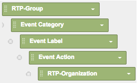

# Google Universal Analytics中的自定义RTP报告{#custom-rtp-reports-in-google-universal-analytics}

>[!PREREQUISITES]
>
>[将RTP与Google Universal Analytics集成](/help/marketo/product-docs/web-personalization/reporting-for-web-personalization/web-analytics-integrations/integrate-rtp-with-google-universal-analytics.md)

本文介绍如何为Google Universal Analytics(GUA)设置RTP自定义报告。  可以将从RTP发送到GUA的数据设置为两个单独的自定义报告，称为：

* RTP B2B
* RTP参与

## 设置自定义报告{#setting-up-a-custom-report}

1. 登录Google Analytics。

1. 单击顶部菜单中的&#x200B;**自定义**。

1. 单击&#x200B;**+新建自定义报告**。

## RTP B2B报告{#rtp-b-b-report}

1. 将报表命名为&#x200B;**RTP B2B报表**。

1. 将第1个选项卡命名为&#x200B;**Industry**。

>[!NOTE]
>
>您将&#x200B;**重复此选项卡**&#x200B;并创建其他类似选项 — 步骤5)

1. 选择&#x200B;**Explorer**&#x200B;报告类型。

   

1. 在&#x200B;**量度组**&#x200B;部分，选择与您的业务相关的量度。

   a.我们建议：

   

1. 重复此选项卡4次，并命名它们：

   1. **行业**
   1. **组**
   1. **类别**
   1. **ABM**
   1. **组织**

   

1. 在&#x200B;**Dimension展开**&#x200B;部分中，将每个选项卡的相关尺寸设置如下。

<table> 
 <thead> 
  <tr> 
   <th> 
    

      选项卡名称 
    
</th> 
   <th> 
    

      Dimension下钻
    
</th> 
  </tr> 
 </thead> 
 <tbody> 
  <tr> 
   <td>行业</td> 
   <td></td> 
  </tr> 
  <tr> 
   <td>组</td> 
   <td></td> 
  </tr> 
  <tr> 
   <td>类别</td> 
   <td></td> 
  </tr> 
  <tr> 
   <td>ABM</td> 
   <td></td> 
  </tr> 
  <tr> 
   <td>组织</td> 
   <td></td> 
  </tr> 
 </tbody> 
</table>

1. 请勿设置任何过滤器，并将此报告设置为可用于&#x200B;**所有网站数据**（或在与特定Analytics帐户相关时进行更改）。

1. 单击&#x200B;**保存**。

   

## RTP参与报告{#rtp-engagement-report}

1. 将报表命名为&#x200B;**RTP参与报告**。

1. 将第1个选项卡名称设置为&#x200B;**所有参与**。

>[!NOTE]
>
>您将重复此选项卡并创建其他类似选项 — 步骤5)

1. 选择&#x200B;**Explorer**&#x200B;报告类型。

   

1. 在“量度组”部分，选择与您的业务相关的量度。 以下是一项建议：

   

1. 重复此选项卡4次，并命名它们：

   1. **所有参与**
   1. **行业参与度**
   1. **按组的参与**
   1. **按类别**
   1. **由反弹道导弹接触**

   

1. 在&#x200B;**Dimension展开**&#x200B;部分中，将每个选项卡的相关尺寸设置如下：

<table> 
 <thead> 
  <tr> 
   <th> 
    

      选项卡名称 
    
</th> 
   <th> 
    

      Dimension下钻 
    
</th> 
  </tr> 
 </thead> 
 <tbody> 
  <tr> 
   <td>所有参与</td> 
   <td></td> 
  </tr> 
  <tr> 
   <td>由反弹道导弹接触</td> 
   <td></td> 
  </tr> 
  <tr> 
   <td>按类别</td> 
   <td></td> 
  </tr> 
  <tr> 
   <td>按组的参与</td> 
   <td></td> 
  </tr> 
  <tr> 
   <td>行业参与度</td> 
   <td></td> 
  </tr> 
 </tbody> 
</table>

1. 设置以下过滤器:

<table> 
 <thead> 
  <tr> 
   <th> 
    

      Inc/Exc 
    
</th> 
   <th> 
    

      字段 
    
</th> 
   <th> 
    

      匹配类型 
    
</th> 
   <th> 
    

      值 
    
</th> 
   <th colspan="1"> 
    

      评论 
    
</th> 
  </tr> 
 </thead> 
 <tbody> 
  <tr> 
   <td>
包括
</td> 
   <td>
事件类别
</td> 
   <td>正则表达式</td> 
   <td>RTP活动|RTP-Recommendations|RTP — 段</td> 
   <td colspan="1">将过滤所有与RTP无关的其他自定义事件</td> 
  </tr> 
  <tr> 
   <td>排除</td> 
   <td>事件标签</td> 
   <td>正则表达式</td> 
   <td>#</td> 
   <td colspan="1">允许您使用活动名称中的#从报表活动中过滤</td> 
  </tr> 
 </tbody> 
</table>

1. 将此报告设置为可用于&#x200B;**所有网站数据**（或根据需要进行更改）。

   

1. 单击&#x200B;**保存**。

>[!MORELIKETHIS]
>
>[将RTP与Google Universal Analytics集成](/help/marketo/product-docs/web-personalization/reporting-for-web-personalization/web-analytics-integrations/integrate-rtp-with-google-universal-analytics.md)
>
>[Google Universal Analytics中的自定义RTP仪表板](/help/marketo/product-docs/web-personalization/reporting-for-web-personalization/web-analytics-integrations/custom-rtp-dashboards-in-google-universal-analytics.md)
