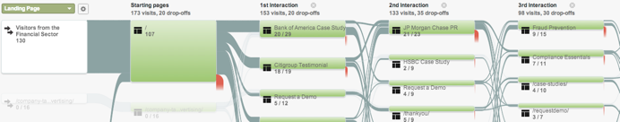
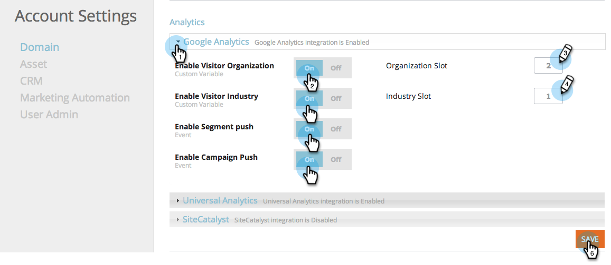

# 将RTP与Google Analytics集成 {#integrate-rtp-with-google-analytics}

>[!NOTE]
>
>Universal Analytics现在是操作标准，Google中的所有资产都已升级到Universal Analytics。
>
>本文说明如何使用旧的Google Standard Analytics，但建议您切换到Universal Analytics。
>
>如果您尚未使用 [analytics.js跟踪代码](https://developers.google.com/analytics/devguides/collection/analyticsjs/)，Google强烈建议您重新标记网站以使用它。 Google将弃用以下内容：
>
>* ga.js
>* urchin.js
>* WAP/服务器端代码片段
>* YT/月
>* 自定义变量
>* 用户定义的变量
>
>了解如何集成 [使用Universal Analytics进行Web个性化](/help/marketo/product-docs/web-personalization/reporting-for-web-personalization/web-analytics-integrations/integrate-rtp-with-google-universal-analytics.md)

## 介绍 {#introduction}

使用从Marketo实时个性化(RTP)到Google Analytics(GA)帐户的直接数据流，从新角度分析网站分析。 根据组织、行业和RTP促销活动，衡量GA中的Web访问量。 查看量度，例如GA中的行业类型或RTP区段，以及它们如何根据不同的流量源（社交、付费、自然）执行和生成商机，分析活动的点击率，以及衡量个性化活动对您网站的影响。 利用此功能从您的RTP帐户中获得最大的好处

**RTPAUDIENCE ANALYTICS**

通过集成，您可以在GA帐户中创建一个新维度。 RTP通过以下方式自动增强您的功能板：

1. 组织和行业
1. RTP中的自定义区段
1. Account-Based Marketing列表

关注您的关键B2B潜在客户。 按目标行业和区段分析渠道。

## 渠道报表 {#channel-report}

RTP B2B仪表板可帮助您根据垂直和RTP分段了解访客的细分情况。 您可以根据金融业和不同的营销活动（付费、免费、社交）查看访客表现。 仪表板还提供RTP区段执行情况的高级概述，并深入显示访问您网站的顶级组织。

## 行为流量 {#behavioral-flow}

行为流量报表（见图像）可可视化访客从一个页面或事件移动到下一个页面或事件的路径。 图像示例显示了金融部门所有访客的路径。 此报告可以帮助您发现哪些内容使访客参与您的网站。

## RTP性能 {#rtp-performance}

衡量您的RTP促销活动，并将其与整个网站的平均值相关联。 了解这些营销活动如何影响您的网站量度，并使用此数据将您的个性化工作重点放在正确的目标上。 生成自定义报告以更好地了解个性化营销活动的执行情况。

## 使用Google Analytics设置RTP {#setting-up-rtp-with-google-analytics}

1. 将电子邮件rtp.ga2@gmail.com作为读取和分析用户添加到您的GA帐户。 有关更多详细信息，请参阅 [此处](https://support.google.com/analytics/answer/2884495?hl=en).

1. 在您的RTP帐户中。 转到 **帐户设置**.

   

1. 下 **帐户设置**， **域** 和 **分析**.

1. 单击 **Google Analytics**.

1. 打开相关 **自定义变量** 和 **事件** 将此数据从RTP附加到Google Analytics。

1. 输入 **插槽** 用于发送自定义变量数据的数量（默认值为1,2）。

1. 单击 **保存**.

>[!NOTE]
>
>要将区段数据发送到GA，请在 [“编辑区段”页](/help/marketo/product-docs/web-personalization/using-web-segments/create-a-basic-web-segment.md) 在RTP平台中，选中复选框 **在区段匹配时向Google Analytics发送事件**.

## 使用RTP数据设置Google Analytics报表 {#setting-up-google-analytics-reports-with-rtp-data}

在Google Analytics中，您可以使用功能板、GA分段和报表来查看RTP数据：

* [仪表板](https://support.google.com/analytics/answer/1068216?hl=en) 提供网站性能的概述。
* GA区段用于在GA界面中过滤访客，并查看每个区段的流量。 了解如何构建区段 [此处](https://support.google.com/analytics/answer/3124493?hl=en).
* 正在创建 [自定义报告](https://support.google.com/analytics/answer/1033013?hl=en) 查看和/或设置计划的电子邮件。 请参阅“自定义”>“新建自定义报表”下的。
