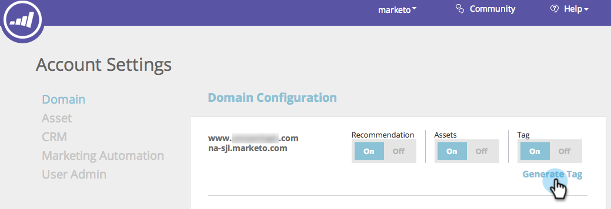

# 部署 RTP JavaScript {#deploy-the-rtp-javascript}

要生成和设置您的RTP标记，请按照下面的安装说明操作

## [!UICONTROL Generate Tag] {#generate-tag}

1. 登录到您的RTP帐户。 前往 **[!UICONTROL Account Settings]**。

   

1. 在&#x200B;**[!UICONTROL Domain]**&#x200B;和&#x200B;**[!UICONTROL Domain Configuration]**&#x200B;中，找到相关域并单击&#x200B;**[!UICONTROL Generate Tag]**。

   

1. 将Web Personalization (RTP)标记复制并粘贴到您的网站中。

   

   >[!NOTE]
   >
   >复制RTP JavaScript标记，并将其粘贴为页眉中的第一个脚本 — 在`<head> </head>`标记之间。

   确保标记出现在所有页面上，包括登陆页面和子域。 可通过右键单击您网站的页面来检查此项。 在Web浏览器中转到查看页面Source 。 搜索：“RTP”。

1. [!UICONTROL Tag]切换设置为&#x200B;**[!UICONTROL ON]**。

   确认[!UICONTROL Tag]切换设置为[!UICONTROL ON]。 您应该会看到数据开始流入组织的选项卡。

   您现在已经设置了RTP标记，可以开始[创建区段](/help/marketo/product-docs/web-personalization/using-web-segments/create-a-basic-web-segment.md)和实时营销活动！

1. 验证标记是否位于所有页面上。
