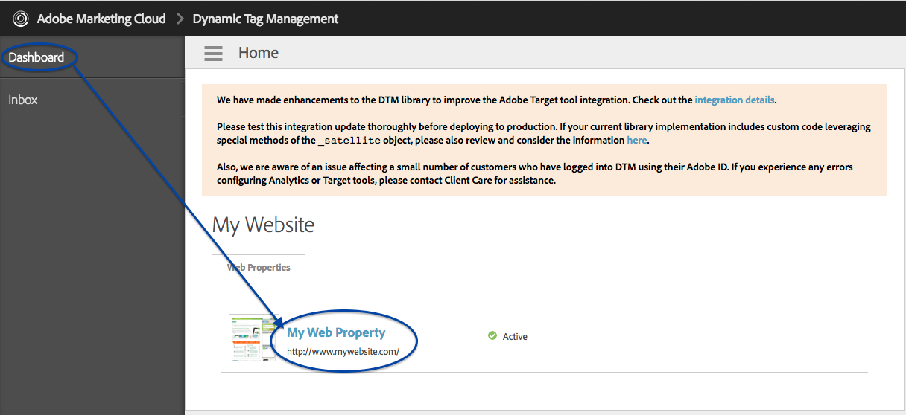

# 使用Adobe Tag Manager实施RTP {#implementing-rtp-using-adobe-tag-manager}

要实施RTP标记，请按照以下安装说明操作：

1. 登录到您的RTP帐户。

1. 转到 **帐户设置**.

   a.如果您已从“支持”处收到JavaScript标记，请继续执行步骤4。

   

1. 在“域”下，找到相关域并单击 **生成标记**.

   

1. 登录您的Dynamic Tag Manager帐户([https://dtm.adobe.com/sign_in](https://dtm.adobe.com/sign_in))。

1. 转到 **功能板。** 单击相关的Web属性。

   

1. 转到 **规则**，单击 **创建新规则**.

1. 填写以下内容

   1. 名称： **Marketo RTP**
   1. 条件（折叠）：触发规则位置 —  **页面顶部**
   1. Javascript（折叠）：单击 **添加新脚本**

   

1. 调用新标记： **Marketo RTP标记**

1. 从RTP标记中删除以下代码

   * ``

1. 粘贴RTP JavaScript标记。

   

   >[!CAUTION]
   >
   >确保删除所有标记并仅保留脚本本身（否） `` )

1. 单击 **保存代码** 和 **保存规则** 在规则编辑器中。

1. 在“规则”面板中，找到Marketo RTP页面加载规则，并在 **操作** 下拉选择 **激活规则**.

   

1. **验证** 显示在所有页面上（包括登陆页面和子域）。

   您可以通过右键单击您网站的页面来执行此操作。 转到 **Inspect元素**，单击 **网络**，搜索： **RTP**.
