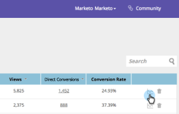

# 了解内容分析 {#understanding-content-analytics}

“内容分析”页面显示您从网站中发现的现有内容（案例研究、博客帖子、视频、新闻稿等）。 它还会显示内容以及访客与内容交互时生成的人员的性能。

## 查看内容分析 {#view-content-analytics}

转到 **内容分析**.

在“内容分析”页面上，您可以：

* 按时间范围（日、周和月）过滤
* 按内容标题和内容URL搜索
* 单击“视图”、“直接转化”和“转化率”的列标题，按降序或升序排序。

您还可以通过单击图标，将文件导出为CSV格式。

Analytics表提供了以下详细信息：

<table> 
 <thead> 
  <tr> 
   <th colspan="1" rowspan="1">名称</th> 
   <th colspan="1" rowspan="1">描述</th> 
  </tr> 
 </thead> 
 <tbody> 
  <tr> 
   <td colspan="1" rowspan="1"><strong>标题</strong></td> 
   <td colspan="1" rowspan="1">数字内容资产的名称。 单击 <strong>标题</strong> 以在新选项卡中打开内容URL。</td> 
  </tr> 
  <tr> 
   <td colspan="1">
<strong>推荐 </strong><strong>图标</strong>

<strong></strong>
</td> 
   <td colspan="1">指示是否已为 <a href="#">内容Recommendations</a>.</td> 
  </tr> 
  <tr> 
   <td colspan="1" rowspan="1">
<strong>视图</strong>
</td> 
   <td colspan="1" rowspan="1">
来自Web访客对内容资产的查看次数。 查看、打开、观看或下载页面的次数。 单击“查看次数”列中的数量可进一步查看内容查看者
</td> 
  </tr> 
  <tr> 
   <td colspan="1" rowspan="1"><strong>直接转化</strong></td> 
   <td colspan="1" rowspan="1">在同一访问中查看内容并填写表单的Web访客</td> 
  </tr> 
  <tr> 
   <td colspan="1">
<strong>Analytics图标</strong>

<strong></strong>
</td> 
   <td colspan="1">查看有关内容片段的更多分析</td> 
  </tr> 
  <tr> 
   <td colspan="1">
<strong>“删除”图标</strong>

</td> 
   <td colspan="1">从内容分析中删除内容</td> 
  </tr> 
 </tbody> 
</table>

## 查看其他内容分析 {#view-additional-content-analytics}

单击内容片段的Analytics图标。

此时将打开一个对话框，其中包含该特定内容片段的其他内容分析。

其他内容分析包括：

**Analytics**

* **视图**:所选时间范围内该内容段的视图
* **直接转化**:在同一访问中查看内容并填写表单的Web访客。
* **转化率****:**由直接转化除以点击量计算的转化率百分比

**趋势**

* A **趋势** 显示特定内容块最近30天视图的图表。 将鼠标悬停在折线图上可查看特定日期的内容查看次数

## 删除内容 {#delete-content}

在“内容分析”页面中，单击要删除的内容的删除图标。 此时将显示一条消息，确认您要删除该内容。

>[!MORELIKETHIS]
>
>* [启用内容推荐栏](/help/marketo/product-docs/predictive-content/enabling-predictive-content/enable-the-content-recommendation-bar.md)
>* [为Web富媒体启用预测内容](/help/marketo/product-docs/predictive-content/enabling-predictive-content/enable-predictive-content-for-web-rich-media.md)

