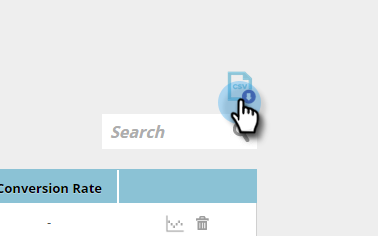

# 了解内容分析{#understanding-content-analytics}

“内容分析”页面显示您从网站中搜索到的现有内容（案例研究、博客文章、视频、新闻稿等）。 它还显示您的内容以及访客与内容互动时生成的人员的表现。

## 视图内容分析{#view-content-analytics}

转到&#x200B;**内容分析**。

在“内容分析”页面上，您可以：

* 按时间范围（日、周和月）过滤
* 按内容标题和内容URL搜索
* 单击视图、直接转换和转化率的列标题，按降序或升序排序。

您还可以通过单击图标以CSV格式导出文件。

“分析”(Analytics)表格提供以下详细信息：

<table> 
 <thead> 
  <tr> 
   <th colspan="1" rowspan="1">名称</th> 
   <th colspan="1" rowspan="1">说明</th> 
  </tr> 
 </thead> 
 <tbody> 
  <tr> 
   <td colspan="1" rowspan="1"><strong>标题</strong></td> 
   <td colspan="1" rowspan="1">数字内容资产的名称。 单击<strong>标题</strong>以在新选项卡中打开内容URL。</td> 
  </tr> 
  <tr> 
   <td colspan="1">
<strong>推荐图 </strong><strong>标</strong>

<strong></strong>
</td> 
   <td colspan="1">表示是否已为<a href="#">内容Recommendations</a>添加内容片段。</td> 
  </tr> 
  <tr> 
   <td colspan="1" rowspan="1">
<strong>视图</strong>
</td> 
   <td colspan="1" rowspan="1">
来自内容资产上Web访客的视图数。 查看、打开、观看或下载它的次数。 单击“视图”列中的数量可向下展开并查看谁查看了内容
</td> 
  </tr> 
  <tr> 
   <td colspan="1" rowspan="1"><strong>直接转换</strong></td> 
   <td colspan="1" rowspan="1">在同一次访问中查看内容并填写表单的Web访客</td> 
  </tr> 
  <tr> 
   <td colspan="1">
<strong>分析图标</strong>

<strong></strong>
</td> 
   <td colspan="1">查看有关内容的更多分析</td> 
  </tr> 
  <tr> 
   <td colspan="1">
<strong>删除图标</strong>

</td> 
   <td colspan="1">从内容分析中删除内容</td> 
  </tr> 
 </tbody> 
</table>

## 视图其他内容分析{#view-additional-content-analytics}

单击内容片段的“分析”图标。

此时将打开一个对话框，其中包含该特定内容片段的其他内容分析。

其他内容分析包括：

**分析**

* **视图**:所选时间范围内该内容片段的视图
* **直接转换**:在同一次访问中查看内容并填写表单的Web访客。
* **转化率****:**由直接转换除以点击量计算的百分比转化率

**趋势**

* 一个&#x200B;**趋势**&#x200B;图表，显示特定内容片段的最近30天视图。 将鼠标悬停在线形图上，可查看特定日期的内容视图数

## 删除内容{#delete-content}

在“内容分析”页面中，单击要删除的内容的删除图标。 此时将显示一条消息，确认您要删除内容。

>[!MORELIKETHIS]
>
>* [启用内容推荐栏](/help/marketo/product-docs/predictive-content/enabling-predictive-content/enable-the-content-recommendation-bar.md)
>* [为Web富媒体启用预测内容](/help/marketo/product-docs/predictive-content/enabling-predictive-content/enable-predictive-content-for-web-rich-media.md)

